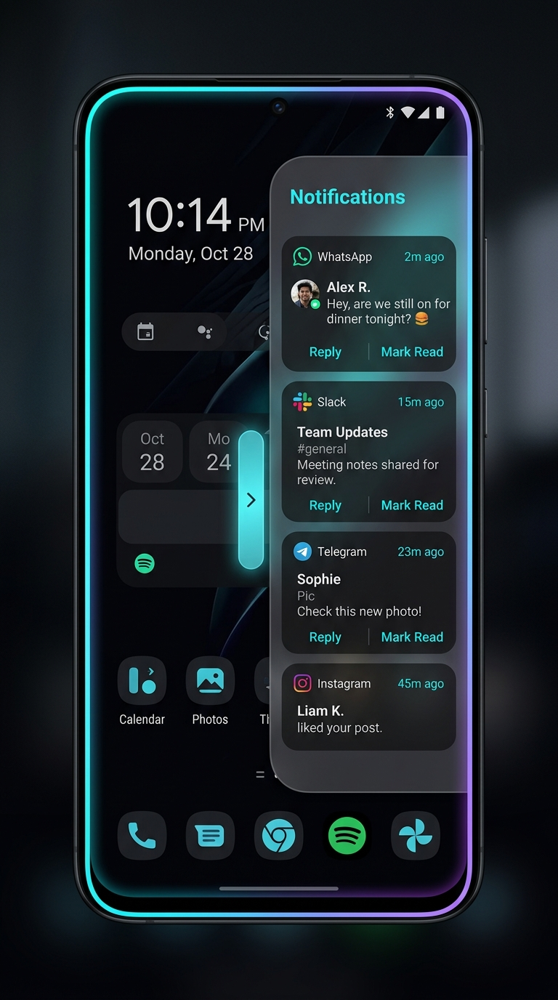

# Notification Edge (알림 엣지)

  

  
  
  

과거 삼성 갤럭시 스마트폰에서 제공되었던 Notification Edge(알림 엣지 패널) 기능을 최신 안드로이드(Android 8.0 ~ 14+) 및 One UI 환경에 맞춰 재구현한 독립형 오버레이 앱입니다.

화면 가장자리 제스처를 통해 최근 알림을 실시간으로 확인하고, 빠른 답장(Quick Reply), 과거 대화 내역 누적 조회, 알림 삭제, 엣지 라이팅(Edge Lighting) 테두리 네온 효과를 순정 엣지처럼 이용할 수 있습니다.

---

## 📥 APK 다운로드 및 설치

최신 빌드 APK는 GitHub Releases에서 바로 다운로드하여 설치할 수 있습니다. 고정 서명 키가 적용되어 있어 앱 삭제 없이 덮어쓰기 업데이트가 지원됩니다.

👉 [최신 Notification Edge APK 다운로드 (Releases)](https://github.com/DevDooly/message_edge/releases/latest)

---

## 💡 갤럭시 기본 엣지 패널 연동 가이드

> 📖 상세한 설정 단계는 [갤럭시 기본 Edge & Good Lock 연동 가이드](docs/Samsung_Edge_Integration_Guide.md) 문서를 참고해 주세요.

갤럭시 스마트폰의 기본 Edge 패널과 알림 엣지가 겹쳐서 불편한 경우, 아래 추천 설정을 사용하면 간섭 없이 쾌적하게 이용할 수 있습니다.

### ⭐ 추천 1: 삼성 Good Lock (One Hand Operation +) 제스처 연동

화면에 별도 핸들을 띄우지 않고, 갤럭시 제스처만으로 알림 엣지를 즉시 호출하는 가장 깔끔한 방법입니다.

1. **앱 설치**: [Google Play Store](https://play.google.com/store/apps/details?id=com.samsung.android.sidegesturepad) 또는 Galaxy Store에서 `One Hand Operation +` 및 `Good Lock`을 설치합니다.
2. **핸들 선택**: `One Hand Operation +` 실행 후 `오른쪽 핸들` (또는 왼쪽 핸들)을 선택합니다.
3. **제스처 지정**: 기본 엣지와 겹치지 않는 제스처(예: `대각선 아래로` 또는 `대각선 아래로 길게 당기기`)를 선택합니다.
4. **동작 등록**: 제스처 동작 목록에서 `애플리케이션 실행` ➔ `Notification Edge`를 선택합니다.
5. **핸들 숨김**: Notification Edge 앱 설정에서 `핸들 바 화면 표시`를 OFF로 변경합니다.
6. **사용 방법**:
   - 수평 스와이프: 삼성 기본 엣지 패널 실행
   - 대각선 아래 스와이프: 알림 엣지 패널 + 테두리 엣지 라이팅 즉시 호출
   - 닫기 제스처: 패널 화면을 터치 후 왼쪽으로 드래그하거나 바깥 투명 영역 터치

---

### 추천 2: 좌/우 분리 배치 (양손 제스처)
- 갤럭시 기본 Edge 패널: 화면 우측(Right) 유지
- Notification Edge: 앱 설정에서 핸들 위치를 `왼쪽 (Left)`으로 설정
- 효과: 오른쪽은 기본 도구 패널, 왼쪽은 알림 엣지로 분리 사용

### 추천 3: 상/하 높이 분리 배치 (동일 방향 사용)
- 갤럭시 기본 Edge 패널: 시스템 설정에서 핸들 위치를 우측 상단(20~30%)으로 이동
- Notification Edge: 앱 설정에서 핸들 위치를 우측 하단(70~80%)으로 설정
- 효과: 엄지가 닿기 쉬운 아래쪽은 알림 엣지, 위쪽은 기본 도구 패널로 사용

---

## 📱 주요 기능

### 1. 실시간 알림 캡처 (Notification Listener)
- 실시간 푸시 알림 수신 및 발신자, 본문, 시간 파싱
- 카카오톡, 문자(SMS) 등 메신저 대화형 알림 지원
- 시스템 상태바에서 알림이 지워져도 패널 히스토리에 과거 알림 최대 150개까지 보관

### 2. 과거 대화 내역 누적 및 확장 조회
- 동일 대화방의 새 메시지 수신 시 이전 대화 뒤에 누적 보관 (최대 50개)
- `이전 대화 더보기` 버튼을 통해 과거 긴 대화 내역 전체 확인 가능

### 3. 슬라이드 아웃 엣지 패널 & 제스처 닫기
- 뒤의 화면을 가리지 않는 100% 완전 투명 배경 오버레이
- 패널 화면 터치 후 왼쪽 드래그(스와이프) 또는 바깥 터치로 즉시 닫기
- 개별 알림 삭제 및 모두 지우기 지원

### 4. 인라인 빠른 답장 (Quick Reply)
- 카카오톡, 문자 등 답장 지원 알림의 경우 패널 내에서 직접 텍스트 답장 전송

### 5. 엣지 라이팅 테두리 효과 (Edge Lighting)
- 알림 수신 시 화면 둘레를 따라 빛나는 네온 그라데이션 애니메이션
- 색상 커스텀 및 발광 시간 조절 지원

### 6. 상세 커스터마이징 & 인앱 자동 업데이트
- 핸들 위치(좌/우, 상하 위치 비율), 크기, 투명도, 색상 조절
- 핸들 바 화면 표시 숨김(제스처 전용 모드) 지원
- 햅틱 진동 피드백 설정
- **GitHub Release 기반 인앱(In-App) 원클릭 자동 업데이트 & 릴리즈 노트 확인 기능**

---

## 🛠 기술 스택

- **Language**: Kotlin 2.0.21
- **UI**: Jetpack Compose, Material 3
- **Architecture**: Modern Android Architecture (MVVM, Clean Architecture)
- **Async / Reactive**: Kotlin Coroutines, StateFlow, SharedFlow
- **Storage**: Jetpack DataStore Preferences
- **System**:
  - `NotificationListenerService`
  - `WindowManager` (TYPE_APPLICATION_OVERLAY)
  - `ComposeView` + Custom `OverlayLifecycleOwner`
  - `ForegroundService`

---

## 🔒 필요 권한 안내

1. **다른 앱 위에 표시**: 화면 가장자리에 엣지 오버레이 패널을 표시하기 위해 필요합니다.
2. **알림 접근 허용**: 수신되는 알림을 감지하여 패널에 표시하기 위해 필요합니다.
3. **배터리 사용량 최적화 중지 (선택)**: 백그라운드 서비스가 절전 모드로 종료되는 것을 방지합니다.
