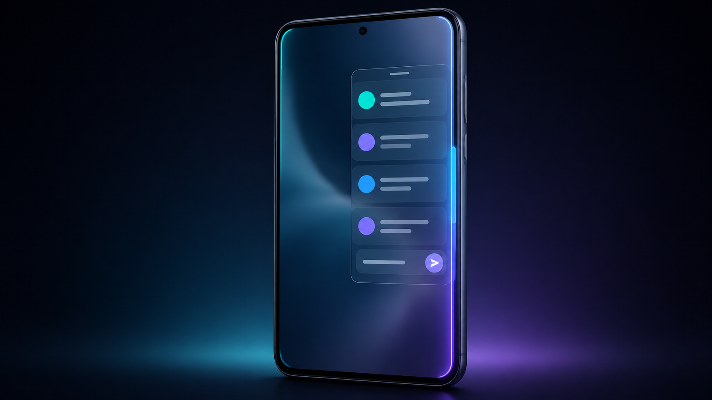
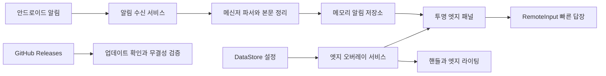

<div align="center">



# Slivue · 슬리뷰

**화면은 그대로, 알림은 바로.**

앱을 전환하지 않고, 화면 가장자리에서 최근 알림을 확인하고 바로 답장하세요.

[](https://github.com/DevDooly/message_edge/releases/latest)
[](https://github.com/DevDooly/message_edge/actions/workflows/release.yml)
[](https://github.com/DevDooly/message_edge/actions/workflows/codeql.yml)
[](https://developer.android.com/about/versions/oreo)
[](LICENSE)

[최신 APK 받기](https://github.com/DevDooly/message_edge/releases/latest) · [설치 안내](#설치) · [Good Lock 연동](docs/Samsung_Edge_Integration_Guide.md) · [개발 문서](docs/DEVELOPMENT_REFERENCE.md) · [이슈 제보](https://github.com/DevDooly/message_edge/issues)

</div>

> 대표 이미지는 기능 이해를 돕기 위한 콘셉트 이미지입니다. 실제 화면은 기기, 안드로이드 버전, 테마와 설정에 따라 달라질 수 있습니다.

## 어떤 앱인가요?

Slivue(슬리뷰)는 안드로이드 알림을 화면 가장자리 패널로 모아 보여주는 오픈소스 앱입니다. 게임, 영상 시청, 웹 탐색 중에도 현재 화면을 벗어나지 않고 최근 알림을 확인할 수 있으며, 알림 앱이 `RemoteInput` 답장을 지원하면 패널에서 바로 답장할 수 있습니다.

`v1.3.18`부터 앱·프로젝트 이름을 **Slivue**로 변경했습니다. 다른 개발자의 동명 앱과 혼동되지 않도록 이전 작업명을 정리한 것으로, 해당 앱의 공식 후속작이나 제휴 제품이 아닙니다. 기존 사용자는 삭제 없이 업데이트할 수 있습니다. 설치·설정 호환성을 위해 Android 패키지 식별자와 GitHub 저장소 주소는 유지합니다.

삼성 Galaxy의 **Good Lock · One Hand Operation +**와 연결하면 화면 핸들을 숨긴 채 원하는 제스처로 패널을 열 수 있습니다. 일반 안드로이드 기기에서는 앱이 제공하는 좌·우 엣지 핸들을 사용할 수 있습니다.

## 핵심 기능

| 기능 | 설명 |
| --- | --- |
| 엣지 알림 패널 | 투명 패널을 화면 가장자리에서 열어 최근 알림과 대화 흐름을 확인합니다. |
| 알림 내 빠른 답장 | 지원 앱의 알림에 답장하고, 보낸 답장도 같은 대화 카드에 이어서 표시합니다. |
| 메시지 정리 | 1:1 대화의 중복 발신자 접두어를 제거하고 단체 대화의 화자 구분은 유지합니다. |
| 알림 필터 | 앱별 제외와 차단 키워드로 패널에 표시할 알림을 제어합니다. |
| 엣지 맞춤 설정 | 좌·우 위치, 핸들 크기·색상·투명도, 패널 너비, 글꼴과 엣지 라이팅을 조절합니다. |
| 자연스러운 화면 제어 | 시스템 상태 표시줄을 가리지 않으며, 뒤로가기 버튼과 제스처로 키보드와 패널을 단계적으로 닫습니다. |
| 외부 실행 연동 | Good Lock, 런처 바로가기, 허용된 외부 명령으로 패널을 바로 열 수 있습니다. |
| 인앱 업데이트 | GitHub Releases에서 새 버전을 확인하고 검증된 APK 다운로드·설치를 시작합니다. |

## 설치

### 1. APK 내려받기

[최신 릴리스 페이지](https://github.com/DevDooly/message_edge/releases/latest)에서 버전명이 붙은 `Slivue-vX.Y.Z.apk` 파일을 내려받아 설치합니다. `v1.3.17` 이전 릴리스의 `NotificationEdge-*.apk` 파일은 당시 이름을 보존합니다.

보안을 위해 이 저장소의 GitHub Releases가 아닌 출처에서 받은 APK는 설치하지 않는 것을 권장합니다. 릴리스에 함께 첨부된 `.sha256` 파일과 내려받은 APK의 해시를 비교하려면 다음 명령을 사용할 수 있습니다.

```powershell
Get-FileHash .\Slivue-vX.Y.Z.apk -Algorithm SHA256
```

```bash
sha256sum ./Slivue-vX.Y.Z.apk
```

### 2. 필수 권한 허용

앱의 설정 화면 안내에 따라 다음 권한을 허용합니다.

시스템 권한 화면에서 허용하거나 취소한 뒤 **뒤로가기**로 돌아오면 Slivue 설정 화면을 이어서 사용할 수 있습니다. 앱을 다시 실행할 필요 없이 권한 상태가 갱신됩니다. 배터리 최적화 예외 설정도 같은 방식으로 복귀합니다.

| 권한 | 사용하는 이유 |
| --- | --- |
| 알림 접근 | 알림 제목·본문·답장 동작을 읽어 엣지 패널에 표시합니다. |
| 다른 앱 위에 표시 | 다른 앱을 사용 중일 때 핸들, 패널과 엣지 라이팅을 표시합니다. |
| 알림 보내기 | 백그라운드 서비스 동작 상태를 시스템 알림으로 안내합니다. |
| 알 수 없는 앱 설치 | 사용자가 인앱 업데이트 설치를 선택한 경우에만 시스템 설치 화면을 엽니다. |

설치가 차단되면 기기의 보안 안내에서 차단 원인을 먼저 확인하세요. Galaxy의 `보안 위험 자동 차단`을 일시적으로 꺼야 하는 환경이라면 APK 출처와 SHA-256을 확인한 뒤, 설치 직후 해당 보호 기능을 다시 켜는 것을 권장합니다.

### 3. 서비스 시작

1. 설정 화면에서 권한 상태가 모두 허용되었는지 확인합니다.
2. `화면 가장자리 엣지 핸들`을 켭니다.
3. 화면 가장자리의 핸들을 밀어 패널이 열리는지 확인합니다.
4. 필요하면 배터리 최적화 설정에서 앱의 백그라운드 실행을 허용합니다.

## Good Lock 제스처로 열기

Samsung Galaxy에서는 핸들을 숨기고 One Hand Operation + 제스처만 사용할 수 있습니다.

1. Galaxy Store에서 `Good Lock`과 `One Hand Operation +`를 설치합니다.
2. One Hand Operation +에서 사용할 핸들과 제스처를 선택합니다.
3. 동작을 `애플리케이션 실행`으로 지정하고 `Slivue`를 선택합니다.
4. Slivue 설정에서 `앱 실행 시 알림 엣지 바로 열기`를 켭니다.
5. 앱의 `핸들 바 화면 표시`를 끕니다.

세부 화면과 권장 제스처 조합은 [Galaxy Good Lock 연동 가이드](docs/Samsung_Edge_Integration_Guide.md)에서 확인할 수 있습니다.

## 개인정보와 보안

- 알림 내용과 빠른 답장 처리는 기기 안에서 수행되며 별도 분석 서버로 전송하지 않습니다.
- 알림 목록은 메모리에서 관리하고, 사용자 설정만 Android DataStore에 저장합니다.
- 인터넷 연결은 GitHub Releases의 업데이트 정보 확인과 사용자가 선택한 APK 다운로드에 사용합니다.
- 업데이트 다운로드는 허용된 HTTPS 호스트만 사용하며, 릴리스 SHA-256 값이 제공되면 설치 전에 무결성을 확인합니다.
- 진단 정보는 알림 원문과 민감한 값을 그대로 남기지 않도록 정제합니다.
- 광고 SDK, 사용자 추적 SDK와 인앱 결제를 포함하지 않습니다.

알림 접근 권한은 운영체제 특성상 알림 내용을 읽을 수 있는 강한 권한입니다. 사용하지 않을 때는 Android 설정에서 언제든 권한을 해제할 수 있습니다.

## 동작 구조



패널은 `EdgePanelActivity`의 투명 액티비티로 열리고, 핸들과 엣지 라이팅은 `EdgeOverlayService`가 관리합니다. 이 구조는 오버레이 위에서도 안드로이드의 뒤로가기 버튼과 가장자리 뒤로가기 제스처가 자연스럽게 동작하도록 설계되어 있습니다.

## 개발 환경

| 항목 | 기준 |
| --- | --- |
| 언어 | Kotlin 2.0.21 |
| 사용자 인터페이스 | Jetpack Compose · Material 3 |
| 최소 안드로이드 | Android 8.0 · API 26 |
| 컴파일·대상 SDK | API 34 |
| 자바 | JDK 17 |
| 상태·설정 | Kotlin Coroutines · Flow · DataStore |
| 테스트 | JUnit · MockK · Turbine · Robolectric · Compose UI Test |

### 로컬 빌드

Android SDK 34와 JDK 17을 준비한 뒤 저장소 루트에서 실행합니다.

```powershell
.\gradlew.bat testDebugUnitTest compileDebugKotlin assembleDebug lintRelease
```

릴리스 APK 빌드에는 별도의 서명 설정이 필요합니다. 실제 키나 비밀번호를 저장소에 추가하지 말고 [서명키 교체·복구 절차](docs/SIGNING_KEY_ROTATION_RUNBOOK.md)와 `keystore.properties.example`을 참고하세요.

### 프로젝트 구성

```text
app/src/main/java/com/devdooly/notificationedge/
├─ data/       알림 모델, 메모리 저장소, 설정 저장소, 업데이트
├─ service/    알림 수신, 엣지 오버레이, 부팅 복원, 외부 실행
├─ ui/
│  ├─ overlay/ 투명 패널, 알림 카드, 빠른 답장, 엣지 라이팅
│  ├─ settings/ 권한, 동작, 표시, 필터와 업데이트 설정
│  └─ theme/   색상, 글꼴과 Compose 테마
└─ util/       메시지 파싱, 본문 정리, 진단 정제와 보조 기능
```

`main` 브랜치에는 단위 테스트·릴리스 빌드, CodeQL 보안 분석이 연결되어 있습니다. API 31·34·35 기기 테스트는 예약 실행과 수동 실행으로 확인합니다.

## 문서

- [Google Play 최초 출시 계획](docs/GOOGLE_PLAY_LAUNCH_PLAN.md)
- [Play 개인정보·권한·Data safety 준비서](docs/GOOGLE_PLAY_PRIVACY_AND_DATA_SAFETY.md)
- [Play 서명·공개 소스·수익화 전략](docs/GOOGLE_PLAY_SIGNING_AND_MONETIZATION.md)
- [프로젝트 구조·소스 분석과 보완 계획](docs/PROJECT_SOURCE_ANALYSIS_AND_HARDENING_PLAN.md)
- [개발 참조와 아키텍처 가이드](docs/DEVELOPMENT_REFERENCE.md)
- [One UI 릴리스 점검표](docs/ONE_UI_RELEASE_CHECKLIST.md)
- [서명키 교체·복구 절차](docs/SIGNING_KEY_ROTATION_RUNBOOK.md)
- [사용자 인터페이스 명세](docs/UI_SPECIFICATION.md)
- [해결 과제와 미해결 이슈](docs/PENDING_ISSUES.md)
- [앱 아이콘 설계 기록](docs/App_Icon_Concepts.md)

## 알려진 제약

- 빠른 답장은 알림에 Android `RemoteInput` 동작을 제공하는 앱에서만 사용할 수 있습니다.
- 제조사별 절전 정책에 따라 백그라운드 서비스 유지 방식이 다를 수 있습니다.
- 전체 화면 영상, 게임, PiP 전환처럼 앱별 창 동작이 다른 환경에서는 표시 방식에 차이가 생길 수 있습니다.
- 사이드로드 앱 설치와 업데이트 허용 절차는 Android 및 One UI 버전에 따라 다릅니다.

## 참여와 문의

버그 재현 절차, 기기 모델, Android·One UI 버전을 포함해 [GitHub Issues](https://github.com/DevDooly/message_edge/issues)에 남겨 주세요. 민감한 알림 원문, 전화번호, 계정 정보와 서명키 자료는 첨부하지 마세요.

## 라이선스

이 프로젝트는 [Apache License 2.0](LICENSE)에 따라 사용할 수 있습니다.
