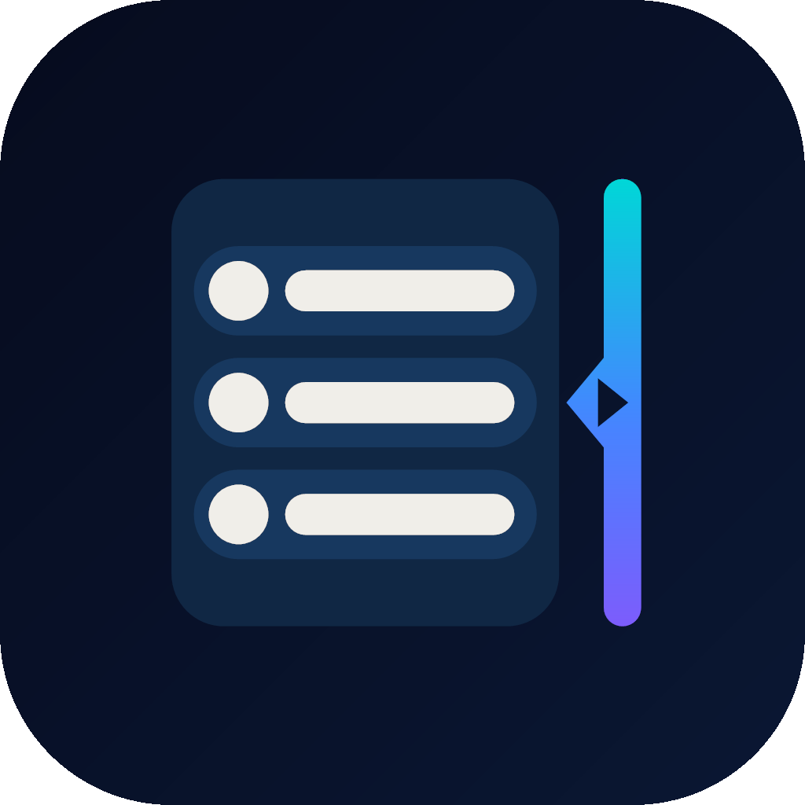

# Notification Edge 앱 아이콘

## 공식 적용 아이콘: 슬라이딩 패널

Notification Edge의 공식 런처 아이콘은 사용자가 선택한 2번 시안을 기반으로 다듬은 **슬라이딩 패널**입니다.

  

### 핵심 표현

- 세 개의 알림 행으로 메시지 목록을 표현합니다.
- 사이언·블루·바이올렛 레일로 화면의 엣지 영역을 강조합니다.
- 중앙의 양각 왼쪽 화살표는 패널을 화면 안으로 꺼내는 동작을 나타냅니다.
- 같은 위치의 음각 오른쪽 화살표는 패널을 엣지로 다시 넣는 동작을 나타냅니다.
- 알림 내용에는 PANTONE 11-4201 Cloud Dancer의 디지털 근사색을 사용합니다.

### 지원 규격

- Android 8.0 이상 Adaptive Icon
- Android 13 이상 Material You 테마 아이콘
- Android 7.1 이하 일반·원형 레거시 아이콘
- Google Play Store 512×512 등록 이미지

### 주요 자산

- [컬러 마스터 SVG](icons/master/notification_edge_sliding_panel_master.svg)
- [단색 마스터 SVG](icons/master/notification_edge_sliding_panel_monochrome.svg)
- [1024px 마스터 PNG](icons/master/notification_edge_sliding_panel_1024.png)
- [Google Play 512px PNG](icons/play_store/notification_edge_sliding_panel_512.png)
- [선택 원본 시안](icons/source/notification_edge_sliding_panel_concept.png)
- [아이콘 팩 관리 안내](icons/README_ICON_PACK.md)

## 디자인 결정 기록

초기 후보는 엣지 펄스, 슬라이딩 패널, 프리즘 알림, 벨 게이트, 제스처 웨이브의 다섯 방향으로 검토했습니다. 그중 앱의 실제 사용 방식인 `화면 가장자리에서 패널을 넣고 빼는 동작`이 가장 직접적으로 보이는 슬라이딩 패널을 채택했습니다.

선택 이후에는 다음 사항을 반영했습니다.

1. Cloud Dancer 계열의 따뜻한 오프화이트를 알림 내용에 적용했습니다.
2. 엣지 레일을 사이언에서 바이올렛으로 이어지는 고대비 그라데이션으로 정리했습니다.
3. 중앙 돌출부를 화살표 형태로 날카롭게 다듬었습니다.
4. 반대 방향은 음각으로 파내어 패널의 열기와 닫기를 한 지점에서 표현했습니다.
5. 작은 런처 크기에서도 형태가 뭉개지지 않도록 그림자와 미세 질감을 제거했습니다.

이전 Edge Whisper 자산은 디자인 변경 이력 확인을 위해 `docs/icons` 아래에 보존합니다.
