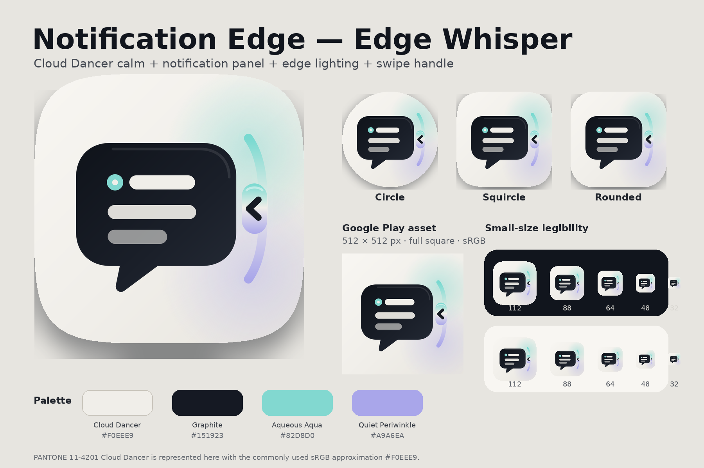
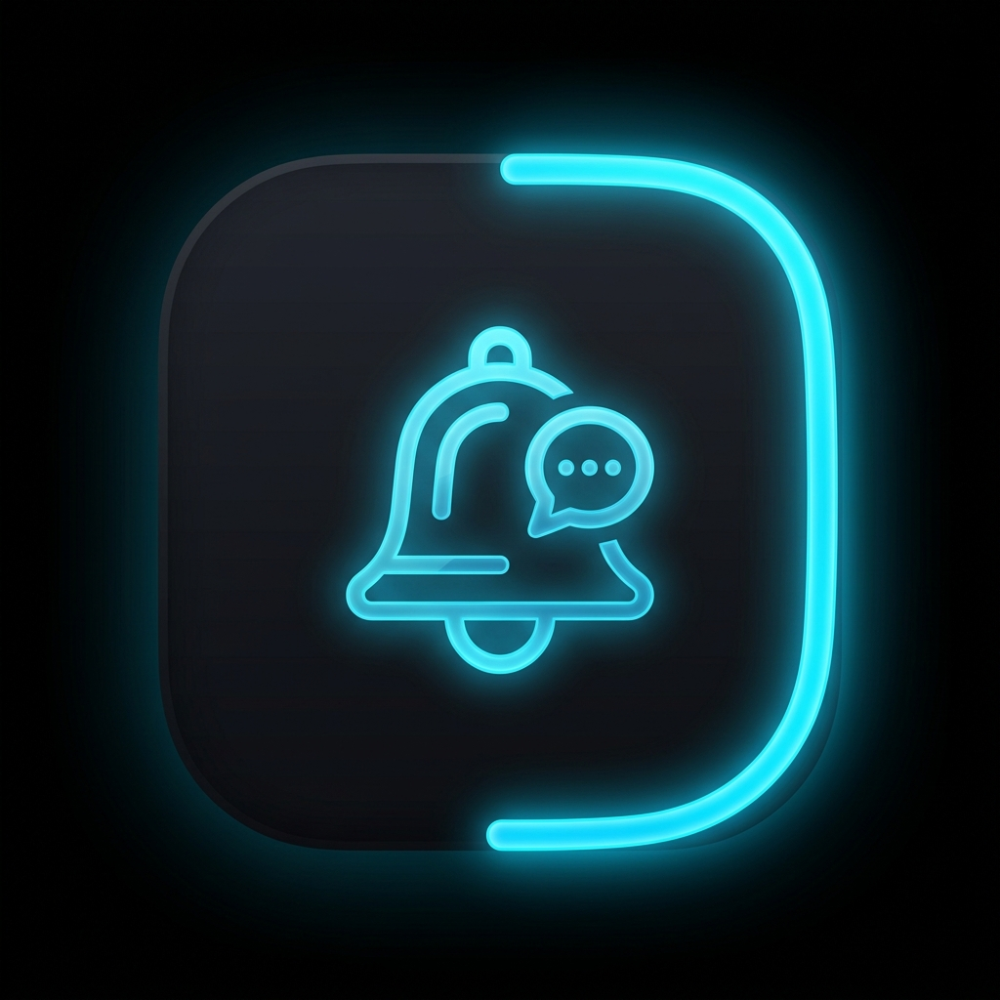
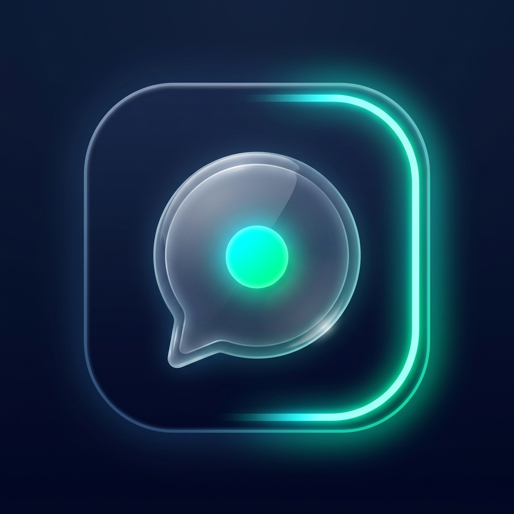
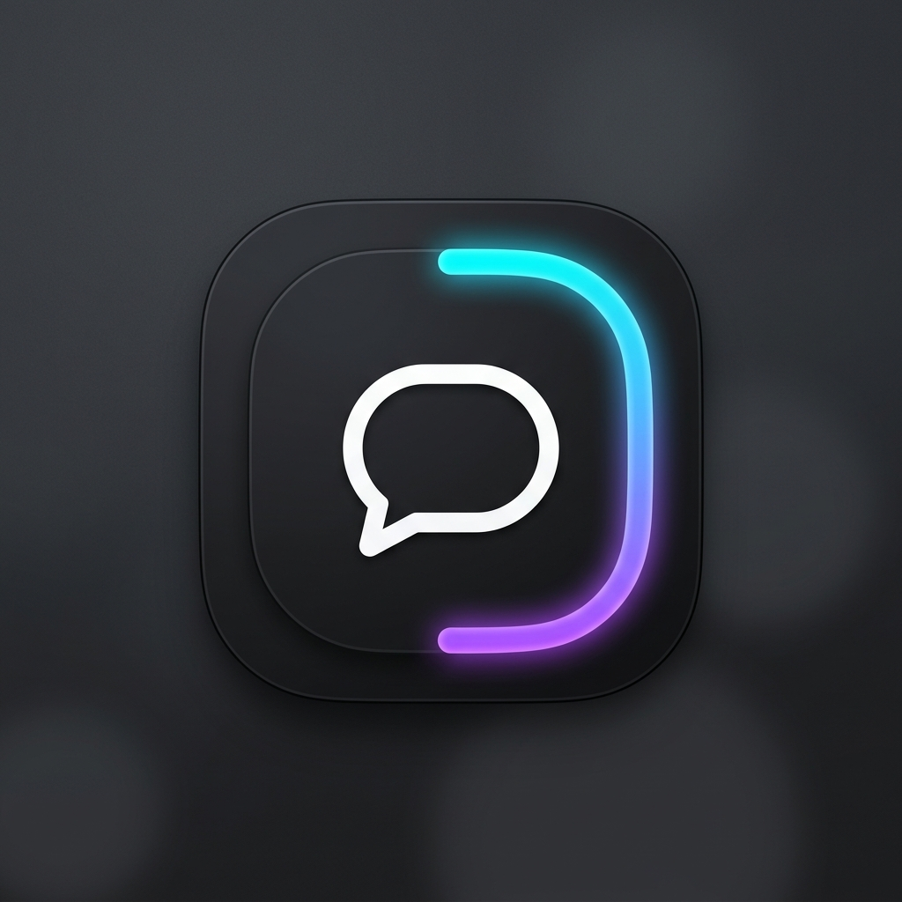
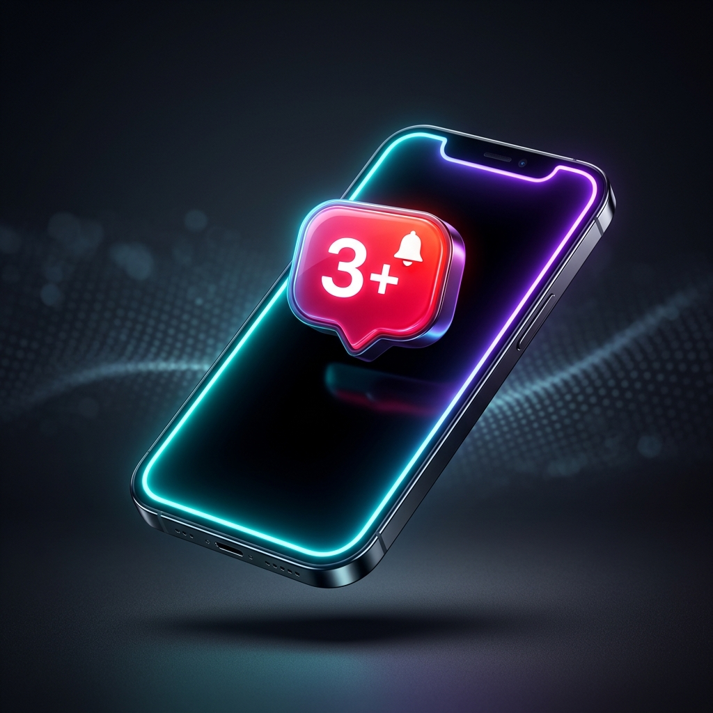
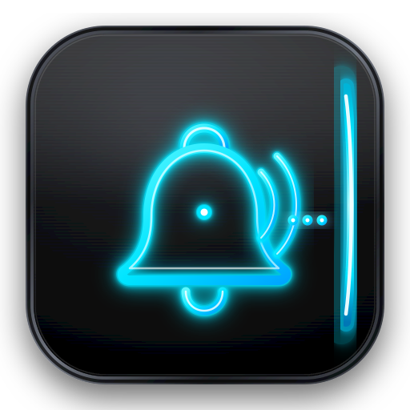

# 🎨 Notification Edge 앱 아이콘 (Official Icon & Concepts)

## 🌟 공식 적용 아이콘: Edge Whisper (v1.2.5+)

Notification Edge 앱의 최종 공식 런처 아이콘으로 채택 및 적용된 **Edge Whisper** 아이콘 팩입니다.

  

* **디자인 컨셉**:
  * **말풍선 실루엣**: 메시지 및 실시간 빠른 답장 상징
  * **3개의 알림 행과 상태 점**: 최근 알림 목록
  * **오른쪽 라이트 레일**: 화면 테두리 엣지 라이팅
  * **중앙 제스처 핸들 & 화살표**: 화면 가장자리에서 안쪽으로 당기는 스와이프 제스처
* **지원 규격**:
  * Android 8.0+ Adaptive Icon (기기별 원형/스퀴클/물방울 마스크 완벽 지원)
  * Android 13+ Themed Monochrome Icon (머티리얼 유 다이내믹 테마 지원)
  * Google Play Store 512x512 공식 스토어 등록 아이콘
* 📂 **자산 경로**:
  * 마스터 SVG: [`docs/icons/master/notification_edge_edge_whisper_master.svg`](icons/master/notification_edge_edge_whisper_master.svg)
  * Play Store 512px: [`docs/icons/play_store/notification_edge_edge_whisper_512.png`](icons/play_store/notification_edge_edge_whisper_512.png)
  * 1024px Master PNG: [`docs/icons/master/notification_edge_edge_whisper_1024.png`](icons/master/notification_edge_edge_whisper_1024.png)

---

## 🏆 기획 디자인 후보군 5종 리스트

| 번호 | 컨셉명 | 스타일 | 추천도 | 주요 특징 |
| :---: | :--- | :--- | :---: | :--- |
| **01** | **네온 벨 & 엣지 아크 (Neon Bell & Edge)** | 사이버펑크 네온 | ⭐⭐⭐⭐ | 딥 다크 배경 + 발광하는 알림 벨 & 말풍선 + 우측 엣지 라이트 라인 |
| **02** | **글래스모피즘 버블 (Glassmorphism Bubble)** | 3D 반투명 유리 | ⭐⭐⭐⭐⭐ | 3D 반투명 프로스티드 글래스 말풍선 + 에메랄드 알림 코어 + 사이드 네온 빔 |
| **03** | **One UI 네온 그라데이션 (One UI Gradient)** | 미니멀 벡터 (추천) | ⭐⭐⭐⭐⭐ | 갤럭시 One UI 스타일의 깔끔한 말풍선 + 사이언/퍼플 엣지 스와이프 곡선 (스토어 최적화) |
| **04** | **3D 엣지 라이팅 스마트폰 (Isometric 3D)** | 3D 입체 렌더링 | ⭐⭐⭐⭐ | 스마트폰 전체 외곽 테두리를 감싸는 네온 엣지 라이팅 + 3D 알림 뱃지 |
| **05** | **메탈릭 네온 벨 & 엣지 바 (Metallic Bell & Bar)** | 다크 메탈릭 테크 | ⭐⭐⭐⭐ | 헤어라인 다크 메탈 텍스처 + 네온 벨 & 우측 엣지 핸들 바 |

---

### 1️⃣ Concept 01: 네온 벨 & 엣지 아크 (Neon Bell & Edge)
> **"어두운 화면 속에서 선명하게 빛나는 알림과 엣지 라이트"**

  

* **특징**:
  * 매트한 다크 블랙 스퀴클 베이스
  * 중앙의 네온 사이언 알림 종(Bell)과 메시지 말풍선 결합 심볼
  * 우측 상단 모서리를 감싸는 부드러운 엣지 라이팅 네온 바
* **장점**: 알림(Notification)과 엣지(Edge)의 두 가지 의미가 직관적으로 전달됨.

---

### 2️⃣ Concept 02: 글래스모피즘 버블 & 네온 빔 (Glassmorphism Bubble)
> **"트렌디한 3D 반투명 글래스와 에메랄드 알림 코어"**

  

* **특징**:
  * 딥 네이비 배경에 입체적인 3D 반투명 유리(Frosted Glass) 말풍선
  * 말풍선 중심에서 빛나는 에메랄드 알림 코어
  * 우측 테두리를 따라 흐르는 고광택 네온 빔
* **장점**: 세련되고 고급스러운 최신 Dribbble/iOS/One UI 트렌드 디자인.

---

### 3️⃣ Concept 03: One UI 네온 그라데이션 (One UI Gradient) 🌟 [강력 추천]
> **"구글 플레이 스토어 및 안드로이드 홈 화면에 가장 이상적인 미니멀 벡터"**

  

* **특징**:
  * 삼성 One UI 디자인 언어와 완벽하게 어우러지는 다크 그라파이트 스퀴클 뱃지
  * 또렷하고 심플한 화이트 말풍선 심볼
  * 사이언 ➔ 일렉트릭 퍼플로 이어지는 감각적인 엣지 스와이프 제스처 네온 곡선
* **장점**: 작은 크기(스마트폰 앱 서랍 / 상태바)에서도 가장 시인성이 뛰어나고 군더더기 없이 깔끔함.

---

### 4️⃣ Concept 04: 3D 엣지 라이팅 스마트폰 (Isometric 3D)
> **"스마트폰 엣지 라이팅과 알림의 시각적 극대화"**

  

* **특징**:
  * 입체적인 다크 스마트폰 외곽을 따라 빛나는 네온 엣지 라이팅
  * 화면 위에 떠 있는 플로팅 알림 뱃지
* **장점**: 앱이 제공하는 '엣지 라이팅' 기능이 시각적으로 매우 화려하게 부각됨.

---

### 5️⃣ Concept 05: 메탈릭 네온 벨 & 엣지 핸들 바 (Metallic Bell & Bar)
> **"단단한 메탈 질감과 직관적인 엣지 핸들 인터페이스"**

  

* **특징**:
  * 브러시드 다크 메탈 텍스처와 견고한 금속 프레임
  * 중앙 네온 벨 + 우측의 선명한 엣지 핸들 바 & 음파 시그널 도트
* **장점**: 공학적이고 전문적인 유틸리티 앱의 무게감 있는 인상 제공.
* 📦 **일러스트레이터 / Figma 편집용 SVG 벡터 파일**:
  * 👉 **[`concept_5_metallic_bell_bar.svg`](icons/concept_5_metallic_bell_bar.svg)**
  * `Layer_Base_Frame`, `Layer_Neon_Edge_Bar`, `Layer_Neon_Bell`, `Layer_Sound_Waves_And_Dots` 레이어 그룹이 완벽히 분리되어 있어 색상, 곡률, 글로우 강도를 자유롭게 수정할 수 있습니다.

---

## 📌 선택 및 적용 방법

마음에 드는 컨셉 번호(예: **Concept 05**)를 말씀해 주시면, 해당 디자인을 안드로이드 규격의 **Adaptive Icon (`res/mipmap-...`)** 포맷으로 앱에 즉시 적용해 드립니다! 🚀
