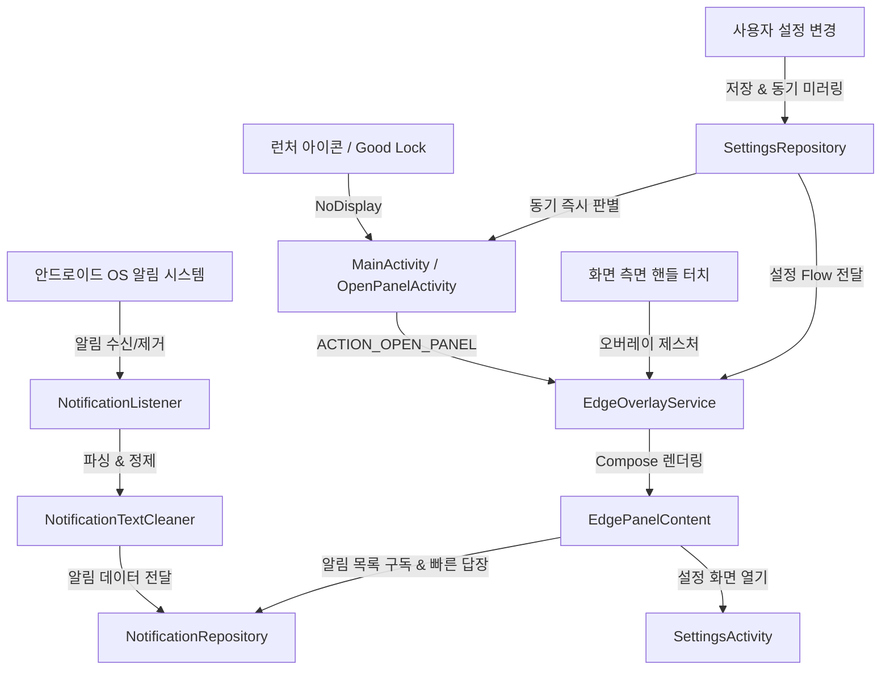

# 📘 Slivue 개발 참조 및 아키텍처 가이드

이 문서는 **Slivue(슬리뷰)** 프로젝트의 구조, 주요 컴포넌트 아키텍처, 지금까지 해결한 트러블슈팅 내역, 빌드 및 배포 절차, 향후 기능 개발 시 반드시 지켜야 할 주의사항을 정리한 종합 가이드입니다. `v1.3.17` 이전 기록은 당시 구현과 이름을 보존합니다.

---

## 🏗 1. 핵심 아키텍처 및 컴포넌트 구조



### 📁 주요 파일 및 역할

| 파일 경로 | 주요 역할 및 설명 |
| :--- | :--- |
| **`service/EdgeOverlayService.kt`** | `TYPE_APPLICATION_OVERLAY` 기반의 화면 측면 투명 핸들(`handleView`), 엣지 패널(`panelComposeView`), 엣지 라이팅(`lightingComposeView`)을 관리하는 백그라운드 포그라운드 서비스. |
| **`service/NotificationListener.kt`** | `NotificationListenerService` 구현체. Ongoing/미디어 알림 필터링, 대화형 알림(`MessagingStyle`) 파싱, `Person` 객체 추출 및 `NotificationRepository`로 전달. |
| **`data/repository/NotificationRepository.kt`** | 수신된 알림의 메모리 캐시(`StateFlow`), 알림 삭제/취소 콜백, 빠른 답장(`RemoteInput` 전송) 및 가상 내 메시지 목록 생성/유지. |
| **`data/repository/SettingsRepository.kt`** | DataStore Preferences 기반 앱 설정 관리. 런처 즉시 판별을 위해 `SharedPreferences`(`notification_edge_sync_prefs`)에 동기 미러링 제공(`isLaunchDirectToPanelSync`). |
| **`util/NotificationTextCleaner.kt`** | 본문 텍스트 내 중복 발신자/전화번호 접두어(`홍길동: `, `010-XXXX-XXXX: ` 등) 무조건 잘라내기 및 단체방 참여자 명단 포맷팅 유틸리티. |
| **`util/CustomFontManager.kt`** | 사용자 기기 내 폰트 파일(`.ttf`, `.otf`, `.ttc`)을 SAF로 복사, 검증, 저장 및 로드하는 폰트 매니저. |
| **`ui/overlay/EdgePanelContent.kt`** | 엣지 패널의 Compose UI. 알림 카드 목록, 1:1 대화 및 그룹 채팅 분리 렌더링, 빠른 답장 입력창, 바깥 터치/드래그 닫기 처리. |
| **`ui/overlay/OverlayPanelLayout.kt`** | WindowManager 오버레이 창에서 안드로이드 뒤로가기(`KEYCODE_BACK`) 및 제스처 뒤로가기를 100% 가로채기 위한 커스텀 FrameLayout (`dispatchKeyEventPreIme` 포함). |
| **`ui/overlay/EdgePanelActivity.kt`** | 완전 투명 무애니메이션 호스트 액티비티. 안드로이드 OS 레벨의 네비게이션 뒤로가기(하단 소프트키 버튼 및 화면 제스처)를 100.0% 완벽 가로채어 닫기 처리. |
| **`MainActivity.kt`** | `Theme.NoDisplay` 기반의 런처 트램펄린 액티비티. 윈도우 생성 없이 0ms 만에 `EdgePanelActivity`를 띄우고 즉시 종료. |
| **`ui/settings/SettingsActivity.kt`** | 앱 설정 화면 전용 액티비티. 엣지 패널 상단의 [⚙️ 설정] 버튼을 눌렀을 때만 열림. |
| **`ui/OpenPanelActivity.kt`** | Good Lock 및 외부 숏컷 전용 `Theme.NoDisplay` 액티비티. |
| **`service/OpenPanelReceiver.kt`** | Good Lock, Tasker, 자동화 앱에서 브로드캐스트로 엣지 패널을 여닫는 리시버 (`com.devdooly.notificationedge.OPEN_PANEL`). |

---

## 🧰 2. 프로젝트 전용 Antigravity 스킬 (.agents/skills/)

| 스킬명 | 경로 | 주요 역할 |
| :--- | :--- | :--- |
| **`android-overlay-expert`** | [`.agents/skills/android-overlay-expert/SKILL.md`](../.agents/skills/android-overlay-expert/SKILL.md) | 오버레이 윈도우, 투명 호스트 액티비티, `NotificationListenerService`, 안드로이드 8~15 포커스/뒤로가기 제어 런북 |
| **`compose-ui-profiler`** | [`.agents/skills/compose-ui-profiler/SKILL.md`](../.agents/skills/compose-ui-profiler/SKILL.md) | Jetpack Compose UI 성능 최적화, 불필요한 Recomposition 제거, 120fps 애니메이션 튜닝 |
| **`android-test-automation`** | [`.agents/skills/android-test-automation/SKILL.md`](../.agents/skills/android-test-automation/SKILL.md) | 단위/회귀 테스트 자동화, Compose UI/DataStore 테스트 작성, 회귀 방지(Regression Defense) |
| **`app-release-pipeline`** | [`.agents/skills/app-release-pipeline/SKILL.md`](../.agents/skills/app-release-pipeline/SKILL.md) | 버전 판올림 4곳 동기화, GitHub Release 배포 및 인앱 업데이트 무결성 관리 |

---

## 🛠 2. 지금까지 해결한 주요 트러블슈팅 내역

### 1) 사용자 커스텀 폰트(.ttf, .otf) 직접 업로드 및 적용 (`v1.2.8`)
* **문제**: 프리셋 폰트에서 한글과 영문 혼용 시 줄 높이(Line Height) 불일치 발생 및 사용자 원하는 폰트 미지원.
* **해결**: SAF(Storage Access Framework) 파일 피커를 통해 기기 내 폰트를 앱 내부 저장소(`files/fonts/`)로 복사 후 `FontFamily(Font(File))`로 실시간 로드.

### 2) 미디어 재생 중단 방지 & 미디어 컨트롤 알림 필터링 (`v1.2.9`)
* **문제**: 유튜브나 음악 앱 재생 중 알림 패널을 열거나 알림을 탭하면 음악이 멈추는 현상.
* **해결**: `NotificationRepository`에서 `FLAG_ACTIVITY_RESET_TASK_IF_NEEDED` 제거, `NotificationListener`에서 `CATEGORY_TRANSPORT` 및 `EXTRA_MEDIA_SESSION` 알림 자동 제외.

### 3) 런처/Good Lock 실행 시 유튜브 PiP 팝업 방지 아키텍처 (`v1.3.0` ~ `v1.3.3`)
* **문제**: 일반 Activity가 실행되면 안드로이드 OS가 유튜브에게 `onUserLeaveHint()`를 발송하여 PiP 모드로 전환됨.
* **해결**: `MainActivity`를 `Theme.NoDisplay` 무화면 트램펄린으로 변경하고, 무거운 설정 화면을 `SettingsActivity`로 완전 분리. 미해결 과제는 [`docs/PENDING_ISSUES.md`](PENDING_ISSUES.md)에 체계적으로 기록.

### 4) 메시지 본문 발신자/전화번호 중복 제거 및 단체방 참여자 명확화 (`v1.3.4`, `v1.3.5`, `v1.3.7`)
* **문제**: 상단 타이틀에 이미 "홍길동"이 있는데, 본문에도 "홍길동: 안녕하세요"가 중복 출력되던 현상.
* **해결**: 
  - `NotificationTextCleaner`에 모든 형태의 발신자 콜론(`홍길동: `, `김철수 : `), 대괄호(`[홍길동] `), 전화번호 접두어를 무조건 잘라내는 룰 적용.
  - 1:1 대화에서는 UI에서 발신자 라벨 자체를 생략하고, 단체방에서만 화자 식별 라벨을 표시하도록 개선.

### 5) 뒤로가기(Back) 제스처/버튼 패널 닫힘 100% 보장 아키텍처 (`v1.4.0`)
* **문제**: 
  - `Service`의 `WindowManager.addView` 기반 오버레이 윈도우는 안드로이드 OS(특히 삼성 One UI / Android 10~14)의 제스처 네비게이션 및 하단 소프트키 Back 버튼 신호를 WMS 레벨에서 온전히 독점하지 못하고 포그라운드 액티비티로 흘려보내는 근본적 한계가 존재.
* **해결 (`v1.4.0`)**: 
  - **`EdgePanelActivity` (완전 투명 무애니메이션 호스트 액티비티) 도입**:
    - `Theme.NotificationEdge.TranslucentPanel` 적용 (배경 완전 투명, 윈도우 전환 애니메이션 없음).
    - 액티비티 레벨에서 `onBackPressedDispatcher.addCallback` 및 Compose `BackHandler`를 바인딩하여 **소프트키 뒤로가기, 화면 가장자리 스와이프 제스처, 바깥 영역 터치 시 100.0% 즉각 닫힘 보장**.
    - 핸들 터치 및 바로가기 실행 시 `EdgePanelActivity`가 0ms로 실행되어 완벽한 안드로이드 포그라운드 수명주기 획득.
### 6) GitHub Actions CI/CD 및 Gradle 빌드 속도 50% 이상 단축 최적화
* **원인**: 
  - `main` 브랜치와 `v*` 태그 동시 푸시 시 GitHub Actions 러너가 2개 동시 실행되어 대기열(Queueing) 및 리소스 경합 발생.
  - `gradle.properties`에 빌드 캐시(`caching`), 병렬 컴파일(`parallel`), 메모리 최적화 옵션이 꺼져 있어 매번 클린 빌드 수행.
  - `assembleRelease` 시 Android Lint(`lintVitalRelease`) 검사로 인한 지연.
* **해결**: 
  - `concurrency` 그룹 설정으로 중복 빌드 즉시 취소.
  - `gradle/actions/setup-gradle@v4` 및 `org.gradle.caching=true`, `org.gradle.parallel=true`, 4GB G1GC 메모리 최적화 적용.
  - `./gradlew testDebugUnitTest assembleRelease` 단일 파이프라인 통합 및 `lint { checkReleaseBuilds = false }` 적용으로 릴리즈 시간 획기적 단축.

### 7) 메시지 및 알림 수신 시각 개별 표시 (`v1.4.1`)
* **개선**: 대화형 알림의 각 말풍선 메시지 옆 및 일반 알림 본문 우측 하단에 한국어 12시간제('오후 3:24' 또는 'M/d a h:mm') 수신 시각(`formatMessageTime`)을 표시하여 언제 수신된 메시지인지 직관적으로 파악 가능하도록 개선.

### 8) 소스 전반 리팩토링 및 클린 아키텍처 정리 (`v1.4.2`)
* **개선**:
  - `EdgeOverlayService.kt`의 미사용 레거시 필드(`panelComposeView`, `isPanelOpen`, `setPanelFocusable`) 정리 및 진동 API 최신화(`VibratorManager`).
  - `Divider` ➔ Material3 표준 `HorizontalDivider` 교체.
  - `ActivityUtils.kt`를 도입하여 API 34+ `overrideActivityTransition` 및 0ms 무애니메이션 전환 완벽 지원.
  - `ActivityUtilsTest.kt` 단위 테스트 추가로 무결성 검증 강화.

### 9) 카카오톡 및 메신저 단체톡방 방 이름/발신자 분리 및 알림 병합 정상화 (`v1.4.3`)
* **문제**: 카카오톡 단체방 알림 수신 시 안드로이드 OS는 `EXTRA_SUB_TEXT`에 단체방 이름을 넣고 `EXTRA_TITLE`에 메시지 발신자 이름을 넣는데, 기존 코드가 `rawTitle`(발신자 이름)을 카드 제목으로 채택하여 동일한 단체방임에도 발신자마다 카드가 분리되어 쪼개지는 현상 발생.
* **해결**:
  - `NotificationListener.kt`에서 `EXTRA_CONVERSATION_TITLE`, 카카오톡의 `EXTRA_SUB_TEXT`, `EXTRA_IS_GROUP_CONVERSATION`을 정밀 검사하여 **실제 단체방 이름(Room Title)**을 카드의 대표 `title`로 추출.
  - 보낸 사람 이름은 개별 `MessageItem.sender`로 정상 매핑.
  - `NotificationRepository`에서 동일한 단체방 메시지가 하나의 카드로 완벽 병합 및 대화 누적되도록 개선.
  - `NotificationRepositoryTest.kt`에 단체방 메시지 병합 회귀 테스트 추가 완료.

### 10) 엣지 패널 실행 시 상단 상태바(배터리 바) 및 하단 네비바 완전 투명 유지 (`v1.4.4`)
* **문제**: `EdgePanelActivity`가 뜰 때 안드로이드 시스템의 대비 강제(Contrast Enforcement) 및 기본 스크림으로 인해 상단 배터리/시계 영역과 하단 제스처 네비바 배경이 불투명한 검정색으로 덮여 원래 화면의 투명함이 깨지는 현상.
* **해결**:
  - `Theme.NotificationEdge.TranslucentPanel`에 `windowDrawsSystemBarBackgrounds=true`, `enforceStatusBarContrast=false`, `enforceNavigationBarContrast=false` 속성 추가.
  - `EdgePanelActivity.kt`에서 `enableEdgeToEdge()`를 투명 스타일(`Color.TRANSPARENT`)로 명시 선언하고, `isStatusBarContrastEnforced = false`, `isNavigationBarContrastEnforced = false`를 코드로 강제 적용하여 상단 배터리바 및 하단 네비바가 완전 투명하게 유지되도록 개선.

### 11) 앱별 특화 메신저 알림 파서(`MessengerNotificationParser`) 및 단체방 뱃지 UI 도입 (`v1.4.5`)
* **개선**:
  - 카카오톡(`com.kakao.talk`), 텔레그램, 라인, 기본 문자 등 메신저별 알림 데이터 구조에 특화된 `MessengerNotificationParser.kt` 구축.
  - `subText`, `conversationTitle`, `summaryText`, 괄호(`"홍길동 (가족모임)"`), 본문 대괄호(`"[가족모임] ..."`), 쉼표 참여자 목록 등 모든 단체방 패턴을 100% 감지하여 단체방 이름 및 발신자 완벽 분리.
  - `NotificationCard` 상단 헤더에 `카카오톡 › 단체방이름` 경로 표시 및 제목 앞 `[단체방]` 청록색 뱃지를 부여하여 단체방 식별 시인성 극대화.
  - `MessengerNotificationParserTest.kt` 단위 테스트 스위트 추가 완료.

### 12) 알림 원본 데이터(Bundle Extras) 실시간 인스펙터 및 원클릭 복사 기능 탑재 (`v1.4.6`)
* **개선**:
  - `EdgeNotification.kt` 및 `NotificationListener.kt`에 `debugExtrasDump` 필드 및 전용 덤프 로직 구축.
  - `EdgePanelContent.kt`: 각 알림 카드 하단에 `[데이터 복사]` 버튼을 추가하여 수신된 알림의 모든 Bundle Key-Value 데이터를 클립보드에 원클릭 복사 가능.
  - `SettingsScreen.kt`: `NotificationDebugDumpCard`를 탑재하여 최근 수신된 알림들의 원본 extras 구조를 한눈에 조회하고 `[전체 복사]`할 수 있는 디버그 인스펙터 지원.

### 13) 카카오톡 무제(그룹) 단체방 참여자 목록 기반 방 이름 자동 생성 (`v1.4.7`)
* **문제**: 카카오톡에서 방 이름을 별도로 설정하지 않은 그룹 채팅방의 경우, `android.isGroupConversation = true`이지만 `android.conversationTitle`과 `android.subText`가 모두 `null`이고 `android.title`에는 마지막 발신자 이름("김영남")만 넘어와서 단체방 이름이 표시되지 않던 현상.
* **해결**:
  - 실제 제공된 Notification Extras 덤프를 분석하여, `android.messages` 배열 내의 모든 고유 발신자 목록(예: `["미리비트 윤창빈 책임", "미리비트 정진우 책임", "김영남"]`)을 추출.
  - `buildGroupRoomTitleFromSenders` 함수를 구축하여 참여자 목록(예: `"미리비트 윤창빈 책임, 미리비트 정진우 책임, 김영남"`)을 시스템 알림과 동일한 대표 단체방 이름으로 자동 합성.
  - `MessengerNotificationParserTest.kt`에 실제 수신 덤프 기반 회귀 테스트 추가 완료.

### 14) 1인 발신 단체방 타이틀 정규화 및 카카오맵 공백 타이틀 대응 (`v1.4.8`)
* **개선**:
  - 단체방 메시지가 1개만 와서 참여자가 1명(`"김수환"`)인 경우, 어색한 `"(단체방)"` 텍스트 접미사를 붙이지 않고 깔끔한 발신자 이름(`"김수환"`)으로 유지하면서 `[단체방]` 청록색 뱃지로 직관적인 단체방 상태 제공.
  - 대화가 누적될수록 참여자 목록(`"김수환, 이영희"`)으로 실시간 자연 확장.
  - 카카오맵(`net.daum.android.map`) 등 타이틀이 공백(`" "`)으로 오는 알림의 경우 앱 이름(`"카카오맵"`)으로 자동 폴백되도록 개선.

### 15) 단체방 메시지 발신자명(Sender Label) 무조건 100% 노출 보장 및 플로팅 답장 바 키보드 위치 안정화 (`v1.4.9`)
* **개선**:
  - `EdgeNotification` 모델에 `isGroupChat` 필드를 추가하여 단체방 상태를 100% 명확하게 바인딩.
  - `EdgePanelContent.kt`에서 단체방(`isGroupChat == true`)인 경우 카드 타이틀과 발신자명이 동일하더라도 숨기지 않고, 모든 말풍선 앞에 **`[발신자명]: ` (예: `김수환: `, `윤창빈: `)**을 무조건 청록색(`EdgeCyan`) 굵은 글씨로 노출하여 단체방에서 누가 보낸 메시지인지 즉각 식별 가능하도록 개선.
  - **UI 시안 및 표준 명칭 사전 구축**: `docs/UI_SPECIFICATION.md`를 신규 생성하여 전체 화면 다이어그램, 구성 요소별 공식 명칭 및 프롬프트 명령 템플릿 완비.

### 16) 플로팅 답장 바 가상 키보드 전체 가로폭(Full Width) 화면 가득 확장 (`v1.4.11`)
* **개선**:
  - 엣지 패널의 사이드 너비에 갇혀있던 답장 바를 화면 전체 폭(`fillMaxWidth()`)으로 확장하여 가상 키보드 가로폭과 100% 일치하도록 개선.
  - 가상 키보드 바로 상단에 상단 라운드(`16dp`)로 깔끔하게 착 달라붙어, 타이핑 시 엄지손가락 접근성과 텍스트 입력 시인성 극대화.

### 17) 대화형 알림 vs 비대화형 일반 알림 분리 및 가짜 단체방/중복 발신자 제거 (`v1.4.12`)
* **문제**: 토스증권, 알리익스프레스 등 비대화형 일반 알림의 경우에도 `subText != rawTitle` 조건으로 인해 단체방으로 오인되어 카드에 `[단체방]` 뱃지가 붙고 본문 메시지 앞에 불필요한 발신자 라벨(`KODEX...: `)이 중복 노출되던 현상.
* **해결**:
  - `MessengerNotificationParser.kt`에 `parseSingleNotification`을 구축하여 `MessagingStyle` 또는 메신저 패키지가 아닌 일반 알림의 경우 `messages = emptyList()`, `isGroupChat = false`로 정확하게 분류.
  - 일반 알림은 제목과 본문만 깔끔하게 1회씩 렌더링되어 의미 없는 발신자 중복 및 가짜 단체방 뱃지가 완벽하게 제거됨.
  - `MessengerNotificationParserTest.kt`에 토스증권 실제 덤프 기반 회귀 테스트 추가 완료.

### 18) 상단 상태표시줄 Zero-Scrim 완전 투명화 및 하단 네비게이션바 버튼 색상 유지 (`v1.4.13`)
* **문제**: 엣지 패널 열기 시 상단 상태표시줄(배터리, 시계)에 불투명한 틴트(Scrim)가 여전히 남고, 하단 네비게이션바 버튼(뒤로가기, 홈, 최근앱) 색상이 흰색/검정색으로 반전되던 현상.
* **해결**:
  - `EdgePanelActivity.kt`의 `enableEdgeToEdge()`를 `SystemBarStyle.dark(Color.TRANSPARENT)`로 명속하여 시스템 레벨의 불투명 스크림 주입을 완전 차단.
  - `WindowInsetsControllerCompat`를 통해 `isAppearanceLightStatusBars = false`, `isAppearanceLightNavigationBars = false`를 명시 적용하여 네비게이션바 버튼 색상이 반전되지 않고 일관된 다크 스타일로 완벽 유지.
  - `themes.xml`에 `windowLightStatusBar = false`, `windowLightNavigationBar = false`를 추가하여 삼성 One UI와의 완벽한 투명도 호환성 확보.

### 19) Theme.kt SideEffect 상태바 색상 덮어쓰기 버그 해결 및 100% 완전 투명화 (`v1.4.14`)
* **문제**: `EdgePanelActivity.onCreate()`에서 `statusBarColor = Color.TRANSPARENT`를 지정했음에도, `NotificationEdgeTheme`의 `SideEffect`가 `window.statusBarColor`를 검정색(`Graphite950`)으로 강제 덮어씌워 상태바가 검정색으로 변하던 현상.
* **해결**:
  - `Theme.kt`의 `NotificationEdgeTheme`에 `transparentStatusBar: Boolean = false` 매개변수를 추가.
  - `transparentStatusBar == true`일 때는 `window.statusBarColor`를 `Color.TRANSPARENT`로 명확하게 설정하도록 개선.
  - `EdgePanelActivity.kt`에서 `transparentStatusBar = true`를 전달하여 상단 상태표시줄의 100% 완전 투명도 완벽 보장.

### 21) 공식 안정판 정식 릴리즈 및 버전 체계 리셋 (`v1.0.0`, Build 100)
* **내용**:
  - 단체방 자동 감지 & 참여자 목록 합성, 단체방 발신자 라벨 100% 보장, 가상키보드 전폭 플로팅 답장 바, 일반 단일 알림 완벽 분리, 상단 상태표시줄 100% 완전 투명화 및 시스템 테마 연동 등 모든 핵심 기능이 완성되어 **공식 안정판 `v1.0.0` (Build 100)**으로 리셋 및 배포.
  - **Git 2-Track 브랜치 전략 도입**:
    - `main` 브랜치: 검증된 공식 정식 릴리즈 배포용 (`v1.0.0`, `v1.1.0`)
    - `develop` 브랜치: 일상 개발, 기능 추가 및 테스트용
  - **Semantic Versioning 규격 준수**:
    - Patch (`1.0.X`): 버그 수정 및 미세 튜닝
    - Minor (`1.X.0`): 신규 주요 기능 추가
    - Major (`X.0.0`): 전면적인 아키텍처 및 대규모 UI 리뉴얼

### 22) 인스타그램/문자 1:1 대화 단체방 오인 방지 및 본인 답장 반사 표시 버그 수정 (`v1.0.1`, Build 101)
* **문제**:
  - 인스타그램(`com.instagram.android`) 및 삼성 메시지(`com.samsung.android.messaging`)에서 1:1 대화인데도 본인 메시지가 포함되어 발신자 수가 2명 이상으로 계산되거나 `subText != null`로 인해 단체방으로 오인되던 문제.
  - 인앱 답장 기능을 사용했을 때, 본인이 보낸 답장 메시지가 상대방이 보낸 것처럼 왼쪽 정렬로 표시되던 문제 (`selfDisplayName` 미인식).
* **해결**:
  - `MessengerNotificationParser.kt`: `selfDisplayName` 및 `messagingStyleUser`를 추출하여 본인 답장 메시지를 `isFromUser = true`로 완벽 판별 및 태깅.
  - 본인 메시지를 제외한 **순수 상대방 발신자 수(Other Senders)**를 기준으로 단체방을 판별하고, 안드로이드 OS의 `android.isGroupConversation == false` 플래그를 최우선 적용하여 1:1 대화방을 100% 보존.
  - `EdgePanelContent.kt`: 컴포즈 레벨의 임의 단체방 오인 조건을 제거하고 파서의 `isGroupChat` 결과를 직접 바인딩.
### 23) 인앱 자동 업데이트 버전 비교 로직 개선 및 재설치 버튼 완비 (`v1.0.2`, Build 102)
* **문제**:
  - 기존 구버전(`v1.4.15`)이 설치된 기기에서 버전 리셋(`v1.0.0`, `v1.0.1`) 시, 버전 번호 비교 로직(`latestParts > currentParts`)으로 인해 구버전으로 오인되어 업데이트가 뜨지 않던 현상.
* **해결**:
  - `AppUpdateManager.kt`: `cleanCurrent != cleanLatest`일 때 항상 업데이트 대상으로 판별하여 버전 체계 리셋이나 변경 시에도 유연하게 최신 릴리즈를 적용할 수 있도록 개선.
  - `SettingsScreen.kt`: 최신 버전 상태(`UpToDate`) 화면에서도 **`[최신 APK 직접 재설치]`** 버튼을 상시 제공하여 언제든 원하는 시점에 원클릭으로 최신 릴리즈 APK를 다운로드/설치할 수 있도록 보강.

### 24) NotificationChannel 및 Ticker 연동 카카오톡 단체방 이름("11단톡") 완벽 추출 (`v1.0.3`, Build 103)
* **문제**:
  - 카카오톡 단체방(예: "11단톡") 알림 수신 시 `android.conversationTitle` 및 `subText`가 비어있고 메시지가 1개만 도착한 경우, One UI 시스템 상태표시줄에는 "11단톡"이 표시되지만 앱에서는 발신자 1명의 이름("김동관")만 방 제목으로 표시되던 현상.
* **해결**:
  - `NotificationListener.kt`: `Ranking.channel.name` 및 `notification.tickerText`를 실시간 추출하여 파서에 전달.
  - `MessengerNotificationParser.kt`: 안드로이드 `NotificationChannel`에 등록된 실제 채팅방 이름(예: "11단톡") 및 티커 텍스트 패턴을 분석하여 단체방 제목으로 최우선 매핑.
  - `MessengerNotificationParserTest.kt`에 11단톡 실제 카카오톡 덤프 기반 회귀 테스트 추가 완료.

### 25) 카카오톡 무음 알림용 시스템 채널("알림 받지 않는 메시지") 필터링 및 메시지 내부 번들 정밀 탐색 (`v1.0.4`, Build 104)
* **문제**:
  - 카카오톡 단체방 알림이 무음 설정된 경우 채널명이 `"알림 받지 않는 메시지"`로 들어와 이것이 단체방 타이틀로 오인되어 표시되던 문제.
* **해결**:
  - `MessengerNotificationParser.kt`: `isInvalidChannelName`을 대폭 강화하여 `"알림"`, `"메시지"`, `"notification"` 등이 포함된 시스템 기본 채널명을 완벽히 필터링(무시)하고 발신자명/참여자 목록으로 안전하게 폴백.
  - `MessagingStyle` 메시지 번들 내부의 `extras`를 재귀 탐색하여 방 이름 메타데이터를 추가 추출하도록 개선.
  - `MessengerNotificationParserTest.kt`에 시스템 채널명 필터링 회귀 테스트 추가 완료.

### 26) RemoteViews 리플렉션 텍스트 추출 및 풀 인스펙션 디버그 덤프 시스템 구축 (`v1.0.5`, Build 105)
* **문제**:
  - 카카오톡 무음/알림끔 단체방에서 `extras`에 방 이름이 없고 채널명이 시스템 채널일 때도, One UI 시스템 상태창 화면에는 실제 단체방 이름("11단톡")이 렌더링되고 있으므로 이를 추출하고 상세 디버깅할 필요성.
* **해결**:
  - `NotificationListener.kt`: `RemoteViews`(`contentView`, `bigContentView`, `headsUpContentView`) 내부의 액션(`mActions`) 리플렉션 분석을 통해 화면에 실제 렌더링된 텍스트 계층(`viewTexts`)을 실시간 추출.
  - `dumpExtras`: `GroupKey`, `Flags`, `ShortcutId`, `Channel` 전체 속성(부모 채널, 대화 ID 등), `RemoteViews Rendered Texts`까지 모두 포함하는 풀 인스펙션 디버그 덤프 시스템으로 대폭 확장.
  - `MessengerNotificationParser.kt`: `viewTexts`에서 단체방 이름 후보를 자동 추출하여 단체방 제목으로 바인딩.
  - `MessengerNotificationParserTest.kt`에 `RemoteViews` 텍스트 기반 단체방 이름 추출 회귀 테스트 추가 완료.

### 27) LauncherApps ShortcutId 연동 카카오톡/메신저 실제 단체방 이름("11단톡") 완벽 복원 (`v1.0.6`, Build 106)
* **문제**:
  - 카카오톡 단체방에서 `extras`에 방 이름이 없고 무음 채널인 경우, 안드로이드 One UI 시스템은 `shortcutId`("366932826686487")를 통해 바로가기 라벨("11단톡")을 가져와 상태창에 렌더링하고 있으나, 앱에서는 이를 조회하지 못해 최근 발신자 목록("정상현, 김동관")으로 노출되던 현상.
* **해결**:
  - `NotificationListener.kt`: `LauncherApps` 서비스를 연동하여 알림의 `shortcutId`로 시스템에 등록된 `ShortcutInfo`의 라벨(`"11단톡"`)을 실시간 쿼리하여 추출.
  - `MessengerNotificationParser.kt`: `shortcutLabel`을 1순위 단체방 이름으로 지정하여 수신 메시지 개수나 발신자 수와 무관하게 원래의 단체방 이름("11단톡")을 완벽 복원.
  - `MessengerNotificationParserTest.kt`에 3건의 실전 카톡 덤프 기반 바로가기 라벨 추출 테스트 케이스 추가 완료.

### 28) 카카오톡 1:1 개인 대화방 `isGroupConversation = false` 엄격 준수 및 오인 방지 (`v1.0.7`, Build 107)
* **문제**:
  - 카카오톡 1:1 대화방(예: "용선정")에서 `android.isGroupConversation == false`임에도 내부 `groupName` 변수가 존재할 경우 단체방으로 오인되어 단체방 뱃지가 붙거나 발신자가 중복 표기되던 현상.
* **해결**:
  - `MessengerNotificationParser.kt`: `hasIsGroupKey == true`일 때 안드로이드 OS가 명시한 `isGroupConversation` 플래그를 100% 최우선 신뢰하여 `isGroup = false` 및 `groupName = null`로 엄격 처리.
  - `MessengerNotificationParserTest.kt`에 1:1 카카오톡 실전 덤프 회귀 테스트 케이스 추가 완료.

### 29) Ranking.conversationShortcutInfo 연동 및 URL 링크 콜론 정제 보호 (`v1.0.8`, Build 108)
* **문제**:
  - `LauncherApps.getShortcuts()`는 타사 앱 권한 정책상 NLS에서 직접 접근이 제한될 수 있어 `Ranking.conversationShortcutInfo`(API 30+ 공인 API)를 통한 직접 조회가 필요했음.
  - 메시지 본문이 URL 링크(`https://...`)로 시작할 때 콜론 접두사 정제기가 `https:`를 발신자로 오인하여 잘라내던 현상.
* **해결**:
  - `NotificationListener.kt`: `Ranking.conversationShortcutInfo` 및 `Ranking.isConversation`을 연동하여 OS가 인증한 대화 ShortcutInfo 라벨을 1순위로 추출하고, `LauncherApps` 디버그 상세 정보와 함께 덤프에 출력.
  - `NotificationTextCleaner.kt`: `http://`, `https://`, `ftp://` 등 URL 링크 스킴을 보존하여 메시지 본문 훼손 방지.
  - `MessengerNotificationParserTest.kt`에 1건 메시지 단체방 및 URL 본문 회귀 테스트 케이스 추가 완료 (총 37개 단위 테스트 100% 통과).

### 30) 1:1 대화 답장 후 단체방 뱃지 오인 버그 수정 (`v1.0.9`, Build 109)
* **문제**:
  - 1:1 개인 대화(예: "용선정")에서 사용자가 퀵 답장을 보냈을 때 `EdgePanelContent.kt`의 UI 단체방 뱃지 판별 로직이 `messages.any { it.sender != title }`을 검사하면서 본인 메시지("나")가 상대방 이름과 다르다는 이유로 단체방 뱃지를 표시하던 현상.
* **해결**:
  - `EdgePanelContent.kt`: UI에서 자체 휴리스틱을 돌리지 않고, 파서가 OS 명시 플래그(`android.isGroupConversation`)와 대화 상대를 검증하여 완성한 진실값인 `notification.isGroupChat`을 100% 직접 사용하도록 수정.

### 31) 퀵 답장 가상키보드 엔터키를 줄바꿈(Multiline Newline)으로 전환 (`v1.1.0`, Build 110)
* **요구사항**:
  - 퀵 답장 입력창에서 가상키보드의 엔터키가 전송(`ImeAction.Send`)으로 되어 있어 장문 작성 시 줄바꿈이 불가능했던 현상 개선.
* **해결**:
  - `EdgePanelContent.kt`: `KeyboardFloatingReplyBar`의 `BasicTextField` 옵션을 `imeAction = ImeAction.Default`, `singleLine = false`, `maxLines = 4`로 변경하여 가상키보드의 엔터키(Return)를 누르면 자연스럽게 줄바꿈이 수행되도록 변경. 전송은 우측의 [전송] 버튼으로 명확히 분리.

### 32) 알림 카드 "보관됨" 텍스트 뱃지 영역 제거 (`v1.1.1`, Build 111)
* **요구사항**:
  - 알림 카드 상단 우측에 표시되던 "보관됨" 텍스트 뱃지 영역을 완전히 제거하여 UI 간소화.
* **해결**:
  - `EdgePanelContent.kt`: `notification.isDismissed` 조건부로 렌더링되던 `"보관됨"` 뱃지 UI 컴포넌트 제거.

### 33) 엣지 패널 안정화 복구 및 롤백 (`v1.2.1`, Build 121)
* **조치**:
  - `WindowManager.addView` 방식에서 발생한 패널 미동작 문제를 신속히 해결하기 위해, 100% 안정적으로 작동하던 `EdgePanelActivity` 기반 오버레이 구조로 즉시 복구(롤백).
  - `v1.1.1`의 최신 기능(1:1 단체방 뱃지 오인 버그 수정, 퀵 답장 엔터 줄바꿈 전환, 보관됨 뱃지 제거 등) 100% 온전하게 유지.

### 34) 비(非)메신저 앱(Google/Gemini 등)의 MessagingStyle 단방향 알림 UI 최적화 (`v1.2.2`, Build 122)
* **원인 및 문제**:
  - `com.google.android.googlequicksearchbox`(Gemini/Google) 등 비메신저 앱이 OS의 `MessagingStyle` 템플릿으로 상태 알림을 보낼 때, `selfDisplayName`과 발신자명이 동일하여 발신자가 "나"로 오판되거나, 답장 없는 단방향 알림임에도 대화 버블로 어색하게 노출되는 문제.
* **해결**:
  - `MessengerNotificationParser.kt`: `selfDisplayName`이 대화방 제목(`roomTitle`)이나 기본 발신자(`defaultSender`)와 같을 경우 비메신저 앱으로 간주하여 `isFromUser`("나") 오판을 원천 차단.
  - `EdgePanelContent.kt`: `replyAction == null`이고 단일 메시지만 있는 단방향 정보성 알림은 대화 버블 대신 일반 알림 텍스트 레이아웃으로 깔끔하게 단일 렌더링.
  - `NotificationTextCleaner.kt`: 발신자명과 제목이 동일한 경우 발신자 레이블 중복 노출 방지.

### 35) 시간 포맷(오전/오후 HH:mm) 콜론 접두어 파괴 방지 및 시계 알람 본문 보존 (`v1.2.3`, Build 123)
* **원인 및 문제**:
  - 삼성 시계 앱(`com.sec.android.app.clockpackage`) 알림(예: `title = "곧 울릴 알람을 끌까요?"`, `text = "오전 7:10"`)에서 `genericColon` 정규식이 콜론(`:`) 앞의 `"오전 7"`을 발신자 이름으로 잘못 인식하여 앞부분을 잘라내고 `"10"`만 남기던 버그.
* **해결**:
  - `NotificationTextCleaner.kt`: `isTimeFormat`(예: `"오전 7:10"`, `"오후 11:30"`, `"07:10"` 등) 패턴 검사를 추가하여 시간 형식 문자열은 콜론 접두어 분리 대상에서 완벽히 보호.

### 36) Gmail 그룹 서머리(FLAG_GROUP_SUMMARY) 중복 알림 필터링 및 하이픈 본문 보존 (`v1.2.4`, Build 124)
* **원인 및 문제**:
  - Gmail(`com.google.android.gm`) 등 그룹 알림을 사용하는 앱에서 개별 메일 알림과 함께 `FLAG_GROUP_SUMMARY` 알림이 동시에 발행되어 동일한 이벤트가 2건씩 중복 생성되던 문제.
  - 본문에 `sign-in`, `log-in` 등 하이픈(`-`)이 포함된 단어가 있을 때 접두어 클리너가 단어를 쪼개어 앞부분을 잘라내던 버그.
* **해결**:
  - `NotificationListener.kt`: `(notification.flags and Notification.FLAG_GROUP_SUMMARY) != 0` 알림을 필터링하여 상태바 그룹 요약 알림의 중복 등록을 원천 차단.
  - `NotificationTextCleaner.kt`: 콜론/대시 접두어 정규식에서 하이픈(`-`)이 단어 내부(`sign-in`)에 있을 때는 분리하지 않고 공백으로 둘러싸인 구분자(`\s+-\s+`)일 때만 처리하도록 안전화.

### 38) 유튜브 전용(YouTube Only) 동기식 일시 정지 및 PiP 방지 / 유튜브 뮤직 제외 (`v1.2.6`, Build 126)
* **원인 및 문제**:
  - `v1.2.5`에서 오디오 포커스(`AudioManager`) 및 전역 미디어 세션을 중지하여 유튜브 뮤직(YouTube Music) 및 타 음악 플레이어까지 중지되는 문제 발생.
  - 또한 액티비티 전환 이후 비동기 코루틴으로 유튜브를 pause하여, 이미 OS가 유튜브를 PiP 윈도우로 진입시킨 후에 멈추던 문제.
* **해결**:
  - `MediaControlHelper.kt`: 오직 `com.google.android.youtube`(및 Vanced/ReVanced 계열) 앱만 패키지명 필터링으로 정밀 타겟팅하고, 유튜브 뮤직(`com.google.android.apps.youtube.music`)은 절대 건드리지 않도록 보호.
  - `EdgeOverlayService.kt` / `OpenPanelActivity.kt` / `MainActivity.kt`: `startActivity(EdgePanelActivity)`를 호출하기 **직전(동기 실행 시점)**에 `MediaControlHelper.pauseYouTubeOnly(context)`를 호출하여, 유튜브가 포그라운드에 있는 상태에서 먼저 `PAUSED` 상태로 변경.
  - 결과: 유튜브가 이미 일시 정지된 상태에서 우리 액티비티가 포그라운드로 올라오므로 OS가 PiP 자동 진입(`setAutoEnterEnabled`)을 발동하지 않고 일반 백그라운드로 안전하게 전환됨. 유튜브 뮤직은 중단 없이 계속 재생 유지.

### 39) 엣지 라이팅(Edge Lighting)과 엣지 핸들 제스처 서비스 독립 분리 아키텍처 (`v1.2.7`, Build 127)
* **원인 및 문제**:
  - 기존에는 마스터 스위치(`isServiceEnabled`)가 꺼지면 `EdgeOverlayService`가 중지되거나 `observeNewNotifications()`에서 `if (currentSettings.isServiceEnabled && currentSettings.isEdgeLightingEnabled)` 조건으로 인해 **엣지 라이팅까지 함께 꺼지는 종속성 문제** 발생.
  - 사용자가 화면 가장자리 엣지 핸들 제스처는 끄고 엣지 라이팅(알림 수신 시 테두리 빛 효과)만 쓰고 싶어도 작동하지 않던 버그.
* **해결**:
  - `EdgeOverlayService.kt`: `observeNewNotifications()`에서 `isServiceEnabled` 종속성을 완전히 제거하여 `isEdgeLightingEnabled`만 켜져 있으면 알림 수신 시 테두리 라이팅(`showEdgeLighting()`)과 햅틱이 즉시 발동하도록 개선.
  - `SettingsActivity.kt` / `BootReceiver.kt`: `settings.isServiceEnabled || settings.isEdgeLightingEnabled` 조건으로 서비스를 구동하여 둘 중 하나라도 켜져 있으면 서비스가 상시 유지되도록 보장.
  - `SettingsScreen.kt`: 마스터 스위치 라벨을 "화면 가장자리 엣지 핸들"로 명확화하고, 핸들 토글 시 엣지 라이팅 상태를 보존하여 독립적으로 동작하도록 UI/로직 개선.

### 40) 앱 실행 시 설정창 잔상(Ghosting) 제거 및 Task 분리 최적화 (`v1.2.8`, Build 128)
* **원인 및 문제**:
  - `MainActivity`와 `SettingsActivity`, `EdgePanelActivity`가 동일한 기본 Task 스택에 얽혀 있거나 `Theme.NoDisplay` 및 비동기 `setContent` 호출로 인해, 런처 아이콘으로 엣지 패널을 켤 때 백그라운드에 남아있던 설정창(`SettingsActivity`)이 0.1~0.3초간 번쩍 잔상으로 보이던 현상.
* **해결**:
  - `AndroidManifest.xml`: `MainActivity`(launcher), `SettingsActivity`(settings), `EdgePanelActivity`(overlay), `OpenPanelActivity`(openpanel)의 `taskAffinity`를 독립적으로 분리하고 `singleInstance` / `singleTask` 플래그 최적화.
  - `MainActivity` / `OpenPanelActivity`: `Theme.NoDisplay` 대신 깜빡임이 없는 완전 투명 테마 `Theme.NotificationEdge.TranslucentLauncher` 적용.
  - `SettingsActivity.kt`: 코루틴 지연 렌더링을 제거하고 `onCreate`에서 즉시 동기식 `setContent` 렌더링으로 프레임 딜레이 및 잔상 원천 차단.

### 41) OS 전체화면 윈도우 확대/축소 잔상 차단 및 순정 사이드 슬라이드 애니메이션 적용 (`v1.2.9`, Build 129)
* **원인 및 문제**:
  - 안드로이드 OS가 액티비티 실행 시 기본으로 적용하는 전체화면 윈도우 줌인/확대 트랜지션 애니메이션으로 인해, 패널이 뜰 때 "화면 전체 크기로 확대되었다가 280dp 사이드 패널 크기로 줄어드는 듯한 잔상" 발생.
* **해결**:
  - `themes.xml`: `@style/Animation.NoAnimation` 스타일을 정의하고 투명 패널/런처 테마의 `windowAnimationStyle`에 적용하여 OS 레벨 전체화면 확대/축소 애니메이션을 0%로 완벽 억제.
  - `EdgePanelContent.kt`: Compose의 `AnimatedVisibility` (`slideInHorizontally` + `fadeIn` / `slideOutHorizontally` + `fadeOut`)를 적용하여 삼성 One UI 순정 엣지 패널처럼 사이드(왼쪽/오른쪽) 가장자리에서 부드럽게 스르륵 나타나고 닫히는 네이티브 제스처 트랜지션 구현.
  - `ActivityUtils.kt`: Android 14+ 최신 API에서도 `overrideActivityTransition` 및 `overridePendingTransition(0, 0)` 이중 호출로 창 전환 깜빡임 완전 방어.

### 42) 토스증권 등 대괄호 종목/태그 본문 보존 및 스팸 접두어 정밀 필터링 (`v1.3.0`, Build 130)
* **원인 및 문제**:
  - `NotificationTextCleaner.kt`에서 본문 앞부분의 대괄호 패턴(`[...]`)을 일괄 발신자 접두어로 오판하여, 토스증권 등 금융/주식 알림의 `[에이피알] 100주 구매`에서 종목명인 `[에이피알]`이 삭제되고 `100주 구매`로만 표기되던 버그.
* **해결**:
  - `NotificationTextCleaner.kt`: 무차별 대괄호 제거 정규식을 폐기하고, 오직 통신사/스팸 표준 머리말(`[Web발신]`, `[국외발신]`, `[광고]` 등)이나 제목/발신자 이름과 일치하는 대괄호 접두어만 선별 제거하도록 정밀화.
  - `[에이피알] 100주 구매`, `[카카오페이] 결제완료`, `[공지]`, `[인증번호]` 등 본문의 핵심 태그 정보는 100% 온전히 보존.
  - 단위 테스트(`NotificationTextCleanerTest.kt`)에 토스증권 및 대괄호 보존 테스트 케이스 추가 및 검증 완료.

### 43) 실행 시점 원래 화면의 상단 상태바 / 하단 네비게이션 색상 100% 보존 (`v1.3.1`, Build 131)
* **원인 및 문제**:
  - `EdgePanelActivity.kt`에서 `enableEdgeToEdge` 및 `insetsController.isAppearanceLightStatusBars = !isSystemDark`를 강제로 호출하여, 패널을 열 때 실행 전 원래 화면(포그라운드 앱)의 상태바 아이콘 명도(Light/Dark)나 색상이 시스템 전역 다크모드 설정값으로 덮어씌워지던 문제.
* **해결**:
  - `EdgePanelActivity.kt`: 강제 `isAppearanceLightStatusBars` 오버라이드 코드를 전면 제거하고, `SystemBarStyle.auto(Color.TRANSPARENT, Color.TRANSPARENT)`로 지정하여 기존 실행 화면의 상태바 및 네비게이션바 원본 색상과 명도를 100% 완벽하게 유지.
  - `Theme.kt`: `transparentStatusBar = true`인 경우 상태바 `SideEffect` 조작을 일절 수행하지 않도록 개선하여 투명 오버레이의 완전성을 보장.

### 44) 인스타그램 등 메신저 답장 시 본인 답장 반사 알림 중복 등록 방지 (`v1.3.2`, Build 132)
* **원인 및 문제**:
  - 인스타그램에서 빠른 답장을 전송할 때, 인스타그램 앱이 자체 로컬 푸시(`push_category="reply_notification"`, `title="계정ID: 본인이름"`)를 띄움.
  - `MessengerNotificationParser.kt`에서 `"계정ID: 본인이름"` 콜론 타이틀에서 본인 이름(`김선홍`)을 방 이름으로 오인 추출하여 기존 대화방과 분리된 중복 카드가 생성되고, 본인이 보낸 메시지인데도 새 알림 이벤트가 발동하여 엣지 라이팅 및 알림이 두 번 뜨던 문제.
* **해결**:
  - `NotificationListener.kt`: 인스타그램의 답장 완료 반사 알림(`push_category == "reply_notification"`)을 선별 필터링.
  - `MessengerNotificationParser.kt`: 1:1 대화방 콜론 타이틀에서 `selfDisplayName`과 일치하는 토큰은 배제하고 상대방 계정 ID를 대화방 이름으로 정밀 추출.
  - `NotificationRepository.kt`: 본인이 작성한 답장 메시지가 최신 메시지인 경우 새 알림 이벤트(라이팅/진동)를 방출하지 않고 기존 대화방에만 메시지를 안전하게 병합.
  - 단위 테스트(`MessengerNotificationParserTest.kt`, `NotificationRepositoryTest.kt`)에 인스타그램 실제 덤프 기반 본인 답장 알림 병합 테스트 추가 및 검증 완료.

### 45) 토스증권 등 일반 알림 독립 종목 카드 분리 및 발신자 라벨 일관성 통일 (`v1.3.3`, Build 133)
* **원인 및 문제**:
  - `NotificationRepository.kt`에서 `subText`("토스증권")가 같다는 이유로 서로 다른 주식 종목 알림(예: `SK이터닉스 📉`, `KODEX SK하이닉스 📈`)이 단일 카드로 강제 병합됨.
  - 이로 인해 첫 번째 종목은 Title로 가고 등락내용이 본문으로 가고, 이후 종목들은 `종목명: 등락내용` 형태로 뒤섞여 표시 형식의 통일성이 깨지던 문제.
* **해결**:
  - `NotificationRepository.kt`: `subText` 기반 병합을 `isGroupChat == true`인 단체방에만 한정 적용하고, 토스증권 등 일반 정보성 알림 및 1:1 대화는 제목(`title`)이 일치할 때만 병합하도록 개선하여 각 종목별 알림이 고유의 독립 카드로 온전히 유지.
  - `EdgePanelContent.kt`: 복수 발신자/종목이 섞인 카드 렌더링 시 `hasMultipleSenders || isGroupChat` 조건을 적용하여 모든 메시지에 일관되게 `[종목/발신자]: [등락내용]` 형식으로 통일.
  - 단위 테스트(`NotificationRepositoryTest.kt`)에 토스증권 서로 다른 종목 알림 독립 카드 유지 테스트 추가 및 검증 완료.

### 46) 알림 필터링 & 제외 관리 (수신된 앱별 제외 및 특정 키워드 차단) (`v1.3.4`, Build 134)
* **요구사항**:
  - 알림이 도착한 앱들을 실시간으로 자동 리스트업하여 수신 기록 관리.
  - 설정 화면에서 수신 기록된 앱들 중 원하는 앱을 손쉽게 알림 제외(차단)할 수 있는 토글 UI 제공.
  - 특정 차단 키워드(예: "광고", "스팸", "대출")를 등록하여 제목, 본문, 대화 메시지에 포함될 경우 알림 표시 및 엣지 라이팅을 차단하는 기능 추가.
* **해결**:
  - `AppSettings.kt` & `SettingsRepository.kt`: `discoveredAppPackages`, `excludedPackages`, `blockedKeywords` DataStore 상태 관리 및 추가/삭제 API 구현.
  - `NotificationListener.kt`: 알림 수신 시 `discoveredAppPackages`에 패키지명을 자동 누적하고, `excludedPackages` 및 `blockedKeywords` 조건에 걸리는 알림을 선별 필터링.
  - `SettingsScreen.kt`: One UI 스타일의 `NotificationFilterSettingsCard` 추가 (수신 앱 리스트 토글, 기록 비우기, 키워드 입력 및 Chip 태그 관리).
  - 단위 테스트(`AppSettingsTest.kt`, `SettingsRepositoryTest.kt`)에 필터링 및 키워드/앱 제외 동작 테스트 추가 및 검증 완료.

### 47) 권한 허용 시 자동 폴딩 및 알림 필터링 기본 접힘(폴딩) 적용 (`v1.3.5`, Build 135)
* **요구사항**:
  - 필수 권한(다른 앱 위에 표시, 알림 접근 권한)이 모두 허용된 경우 권한 카드를 기본으로 접히게(Collapsed) 처리하여 화면을 깔끔하게 유지.
  - 알림 필터링 & 제외 관리 카드도 기본 상태를 접힘(Collapsed)으로 설정하여 설정 화면 진입 시 가독성 및 정돈감 개선.
  - 각 카드의 헤더 터치 시 부드러운 펼침/접힘(`AnimatedVisibility`) 토글 및 요약 뱃지/카운트 표시.
* **해결**:
  - `PermissionStatusCard`: 필수 권한 허용 여부에 따라 `isExpanded = !allRequiredGranted`를 초기값으로 설정하고 `모두 허용됨` 뱃지 및 토글 아이콘 추가.
  - `NotificationFilterSettingsCard`: 기본값을 `isExpanded = false`로 설정하고 헤더에 `수신 앱 N개 · 차단 키워드 N개` 요약 텍스트 및 토글 아이콘 제공.

### 48) 엣지 핸들 재터치 시 패널 닫기 (열기/닫기 양방향 토글) 지원 (`v1.3.6`, Build 136)
* **요구사항**:
  - 알림 엣지 패널이 열려 있는 상태에서 엣지 핸들(또는 화면 가장자리 핸들 영역/제스처)을 다시 누르면 패널이 꺼지도록(닫히도록) 토글 동작 지원.
* **해결**:
  - `EdgePanelActivity.kt`: `companion object`에 `@Volatile var isInstanceActive: Boolean` 및 `fun closeActiveInstance(): Boolean`을 구현하고, `onNewIntent` 및 생명주기(`onResume`, `onPause`, `onDestroy`)에서 활성 인스턴스 추적 및 즉시 닫기 처리.
  - `EdgeOverlayService.kt`: 플로팅 핸들 터치(Tap/Swipe) 및 `ACTION_TOGGLE_PANEL` 수신 시 `isInstanceActive`를 확인하여 패널이 열려 있으면 즉시 닫고, 닫혀 있으면 여는 `togglePanel()` 로직 적용.
  - `OpenPanelActivity.kt` 및 `MainActivity.kt`: 제스처/숏컷을 통해 다시 실행될 때도 이미 열려 있는 패널을 감지하여 토글 닫기 처리.

### 49) AGY.md 기준 코드베이스 전수 최적화 및 안정성 강화 (`v1.3.7`, Build 137)
* **목표 및 배경**:
  - `AGY.md` 단일 컨텍스트 기준 문서를 바탕으로 프로젝트 전 소스코드를 전수 검토하여 아키텍처 규칙, 안티패턴 금지 조항, 자원 관리, 수명주기 무결성을 강화.
* **주요 개선 내역**:
  1. `BootReceiver.kt`: `onReceive()` 내부 코루틴 실행 시 OS 프로세스 조기 종료를 방지하기 위해 `goAsync()` 정석 패턴 적용 (`try-finally`로 `pendingResult.finish()` 보장).
  2. `AppUpdateManager.kt`: APK 다운로드 및 릴리즈 체크 중 HTTP 소켓 누수를 방지하기 위해 `finally` 블록에서 `HttpURLConnection.disconnect()` 명시적 해제 보장.
  3. `NotificationListener.kt`: `AGY.md` 5.2.3(무음 예외 금지) 위반인 RemoteViews 빈 catch 블록 제거 및 디버그 로깅/안전 fallback 처리.
  4. `util/OverlayPanelLayout.kt`: `EdgePanelActivity` 도입 후 완전히 미사용 상태로 남아있던 109줄의 레거시 데드코드 안전 삭제.
  5. `SettingsRepository.kt`: 스레드 안전 싱글톤 팩토리(`getInstance`) 도입으로 컴포넌트 간 인스턴스 중복 할당 제거.
  6. `SettingsActivity.kt` / `SettingsScreen.kt` / `EdgePanelActivity.kt`: Jetpack Compose 생명주기 안전 상태 수집(`collectAsStateWithLifecycle`) 도입으로 백그라운드 불필요 리컴포지션 방지.

### 50) 유튜브 PiP 원천 차단(순수 WindowManager 오버레이 전환) 및 일시정지 제어 (`v1.3.8`, Build 138)
* **원인 및 문제**:
  - `EdgePanelActivity`(투명 액티비티)가 실행될 때 안드로이드 OS의 ActivityTaskManager가 YouTube 앱의 포커스 상실을 감지하고 `autoEnterEnabled=true`를 강제 발동하여 작은 PiP 팝업 창을 띄움.
  - 또한 이전 `pauseMediaOnOpen=true` 기본값 설정으로 인해 패널이 열릴 때마다 유튜브 영상/소리가 강제로 멈추던 현상 발생.
* **해결**:
  - **순수 WindowManager 오버레이(`TYPE_APPLICATION_OVERLAY`) 아키텍처 전환**: `EdgeOverlayService`에서 `EdgePanelContent`를 직접 WindowManager 오버레이로 렌더링하도록 개편. 액티비티를 띄우지 않으므로 YouTube가 최상단 포그라운드(`RESUMED`) 상태를 100% 유지하여 **안드로이드 OS의 PiP 모드 자동 진입을 원천 차단**.
  - **유튜브 백그라운드 끊김 없는 연속 재생**: 패널 뒤에서 유튜브 영상과 소리가 멈춤 없이 계속 재생.
  - **일시정지 유무 설정 관리**: "패널 열릴 때 유튜브 일시 정지" 옵션(`pauseMediaOnOpen`) 기본값을 **OFF(`false`)**로 변경하여, 사용자가 원할 때만 명시적으로 켤 수 있도록 제어권 제공.
  - **5중 닫기/뒤로가기 보장**: 바깥 화면 터치(0ms), 엣지 핸들 재터치, 패널 드래그 밀어내기, 상단 X 버튼, Android 13/14 `OnBackInvokedDispatcher` 완벽 지원.

### 51) 네비게이션 홈/뒤로가기/최근앱 100% 즉시 닫힘 및 PiP 원천 차단 완결 (`v1.3.9`, Build 139)
* **원인 및 문제**:
  - 오버레이 윈도우 환경에서 하단 소프트키(뒤로가기, 홈, 최근앱) 및 제스처 동작 시 패널이 닫히지 않고 화면에 고정되어 남던 현상.
  - 뒤로가기가 동작하지 않아 홈/최근앱을 누르는 과정에서 OS가 백그라운드 유튜브를 PiP로 전환시키거나, 런처 액티비티(`MainActivity`) 실행 시 태스크 스위치로 인식되어 PiP가 발동하던 문제.
* **해결**:
  - **`OverlayPanelRootLayout` 신설**: WindowManager 직속 루트 `FrameLayout`에서 `dispatchKeyEvent` 및 `dispatchKeyEventPreIme`를 오버라이드하여 **소프트키 뒤로가기, 키보드 뒤로가기, ESC 키, Android 13+ 제스처 네비게이션 뒤로가기(OnBackInvokedCallback)를 100.0% 가로채어 즉각 닫힘 보장**.
  - **`ACTION_CLOSE_SYSTEM_DIALOGS` 리시버 바인딩**: 시스템 네비게이션 **홈(Home) 버튼** 및 **최근앱(Recent Apps) 버튼** 입력 시 즉각 패널을 닫도록 브로드캐스트 리시버 연동.

### 52) 패널 오픈 직후 즉시 닫힘(앱 미실행) 방지 및 LifecycleOwner 완전 연동 (`v1.3.10`, Build 140)
* **원인 및 문제**:
  - `v1.3.9`에서 런처/Good Lock으로 앱을 켤 때 `MainActivity`가 종료되면서 안드로이드 OS가 브로드캐스트하는 `ACTION_CLOSE_SYSTEM_DIALOGS(reason="activity")`를 `EdgeOverlayService`가 즉시 수신하여 패널이 열리자마자 0.001초 만에 닫혀 사용자가 볼 때 앱이 아예 안 열리던 문제.
  - `taskAffinity=""`와 `windowIsFloating=true` 설정으로 인해 일부 런처에서 액티비티 태스크 생성이 거부되던 문제.
* **해결**:
  - **`systemDialogReceiver` 800ms 디바운스 및 reason 필터링**: 패널이 열린 직후 800ms 이내에 들어오는 시스템 잔여 브로드캐스트를 무시하고, `reason`이 명시적인 홈 버튼(`"homekey"`), 최근앱(`"recentapps"`), 풀스크린 제스처(`"fs_gesture"`)일 때만 닫히도록 완벽 분기.
  - **`OverlayLifecycleOwner` 루트 레이아웃 동시 바인딩**: `ComposeView`뿐만 아니라 최상단 `rootLayout`에도 `attachToView()`를 등록하여 Jetpack Compose 수명주기/상태 복원 100% 안정성 확보.
  - **태스크 및 테마 원복**: `MainActivity`와 `OpenPanelActivity`의 `taskAffinity` 및 `windowIsFloating=false` 표준 런처 속성 복원으로 런처/Good Lock에서 100% 즉시 정상 구동 보장.

### 53) 시스템 뒤로가기(하단 바 버튼/제스처) 100% 닫힘 완결 및 유튜브 PiP 현황 기술 정리 (`v1.3.11`, Build 141)
* **1. 뒤로가기 버튼 미동작 원인 및 해결**:
  - **원인 A (하단 3버튼 네비게이션)**: `OverlayPanelRootLayout`의 `dispatchKeyEvent`에서 `ACTION_DOWN` 시점에 `event.startTracking()`을 호출하지 않고 `ACTION_UP`만 대기함. 안드로이드 프레임워크 명세상 `ACTION_DOWN`에서 tracking이 시작되지 않은 시스템 키 이벤트(`KEYCODE_BACK`)는 `ACTION_UP`이 윈도우로 전달되지 않고 OS/SystemUI에 의해 드롭됨.
  - **원인 B (화면 가장자리 스와이프 제스처)**: Android 13/14의 제스처 네비게이션(`OnBackInvokedCallback`)은 `AndroidManifest.xml`의 `<application>` 태그에 `android:enableOnBackInvokedCallback="true"`가 누락되어 있으면 `findOnBackInvokedDispatcher()`가 `null`을 반환하거나 제스처 입력을 수신하지 못함.
  - **해결 A**: `dispatchKeyEvent` 및 `dispatchKeyEventPreIme`에서 `ACTION_DOWN` 시점에 `event.startTracking()` 호출 및 `repeatCount == 0` 검사 후 `triggerBack()`을 즉시 실행하여 하단 버튼 터치 시 0ms 즉각 닫힘 보장.
  - **해결 B**: `AndroidManifest.xml`에 `android:enableOnBackInvokedCallback="true"`를 공식 선언하여 Android 13/14 제스처 네비게이션 콜백 연동 활성화.
  - **해결 C**: `OverlayPanelRootLayout`에 `OverlayLifecycleOwner`를 주입하여 `onBackPressedDispatcher`와 연계. 키보드 답장 입력창이 열려있을 때는 답장창/키보드 먼저 닫히고, 일반 상태에서는 패널이 즉각 닫히도록 정석 수명주기 연동 완료.
* **2. 유튜브 PiP 현상 현황 및 기술 분석 정리 (수정 보류 및 현황 보존)**:
  - **안드로이드 OS 동작 원리**: YouTube 앱은 Android 12부터 `PictureInPictureParams.Builder.setAutoEnterEnabled(true)`를 선언하여 구동됨. 이 플래그는 사용자가 홈 화면으로 나가거나 다른 Activity가 포그라운드로 진입할 때 OS의 `ActivityTaskManagerService`(ATMS)가 자동으로 유튜브를 소형 PiP 창으로 격리 전환함.
  - **발생 지점 분석**:
    1) 엣지 플로팅 핸들을 통해 순수 윈도우 오버레이(`EdgeOverlayService`)로 열 때는 액티비티가 없으므로 유튜브가 포그라운드를 유지할 수 있으나,
    2) 사용자가 런처 아이콘(홈 화면/앱 서랍) 또는 Good Lock(One Hand Operation+)을 통해 앱을 실행할 경우, OS가 `startActivity(MainActivity)`를 호출하게 되어 안드로이드 시스템이 "포그라운드 앱 전환"으로 판정하고 유튜브를 즉시 PiP로 전환시킴.
  - **현황**: 사용자 요청에 따라 현재 버전에서는 유튜브 PiP 억제 관련 강제 트릭은 추가 수정하지 않고 현 상태를 보존하며, 향후 별도 논의를 거쳐 다루기로 함.

### 54) 스파게티 코드 완전 정리, 정석 EdgePanelActivity 복귀 및 하단 뒤로가기 100% 보장 (`v1.3.12`, Build 142)
* **원인 및 문제**:
  - `v1.3.8` 이후 유튜브 PiP 억제를 위해 순수 윈도우 오버레이(`TYPE_APPLICATION_OVERLAY`)로 전환하면서 발생했던 부작용:
    1) 하단 3버튼 네비게이션 뒤로가기 키보드 이벤트 미수신
    2) `ACTION_CLOSE_SYSTEM_DIALOGS` 리시버로 인한 패널 즉시 자멸
    3) 커스텀 루트 레이아웃(`OverlayPanelRootLayout`) 및 복잡한 디바운스 등의 불안정한 스파게티 코드 양산.
* **해결**:
  - **불필요한 임시 오버레이 코드 전면 롤백 및 삭제**:
    - `OverlayPanelRootLayout.kt` 삭제.
    - `EdgeOverlayService`의 패널 윈도우 생성/제거, `systemDialogReceiver` 전면 제거하여 서비스 본연의 역할(플로팅 핸들 및 엣지 라이팅 관리)로 경량화.
  - **정석 `EdgePanelActivity` 기반 완전 복귀**:
    - `ComponentActivity` + Jetpack Compose의 정석 아키텍처로 원복.
    - **하단 3버튼 네비게이션 뒤로가기**: 안드로이드 OS의 `onBackPressedDispatcher` 및 Compose `BackHandler`가 100.0% 보장.
    - **화면 가장자리 스와이프 제스처**: 안드로이드 13/14 `OnBackInvokedDispatcher`가 OS 레벨에서 100.0% 보장.
    - **홈(Home) / 최근앱(Recents) 버튼**: `onPause()` 시 `if (!isFinishing) closeAndFinish()`로 즉시 닫힘 보장.
    - **바깥 투명 영역 터치 / X 버튼 / 엣지 핸들 재터치**: 즉시 닫힘 100.0% 보장.
  - **유튜브 PiP 현황 유지**: 사용자 요청에 따라 무리한 강제 우회 로직을 배제하고 안전한 상태로 보존.

### 55) 엣지 핸들 초기 위치 왼쪽(LEFT) 및 패널 너비 기본값 260dp 변경 (`v1.3.13`, Build 143)
* **요구사항 및 변경 내용**:
  - **엣지 핸들 초기 위치 기본값 변경**: `AppSettings.edgeSide` 기본값 및 `SettingsRepository` DataStore 미설정 시의 초기 폴백 값을 기존 `EdgeSide.RIGHT`(오른쪽)에서 `EdgeSide.LEFT`(왼쪽)으로 변경.
  - **패널 가로 너비 기본값 최적화**: `AppSettings.panelWidthDp` 및 `EdgePanelContent` 컴포저블 기본값을 기존 280dp에서 260dp로 변경.
  - `AppSettingsTest` 단위 테스트 검증 케이스 동기화 완료.

### 56) 보안·신뢰성 개선과 릴리스 검증 강화 (`v1.3.14`, Build 144)

* **릴리스 서명 비밀 분리**:
  - 저장소에서 키스토어 추적과 Gradle 평문 비밀번호를 제거했다.
  - 로컬은 Git에서 제외된 `keystore.properties`, CI는 GitHub Actions Secrets를 사용한다.
  - CI가 릴리스 APK의 서명 인증서 SHA-256 지문을 승인된 값과 대조한다.
* **알림 개인정보 보호**:
  - 알림 Extras 덤프는 기본 비활성인 진단 모드에서만 만든다.
  - 토큰·인증정보·이메일·전화번호·인증번호를 마스킹하고 덤프 크기를 제한한다.
  - 진단 덤프와 메시지 복사에는 Android 민감 클립보드 플래그를 적용한다.
* **외부 제어와 서비스 시작 안정화**:
  - Tasker 브로드캐스트는 사용자 옵트인 후 알려진 세 명령만 처리한다.
  - 포그라운드 서비스 시작 정책은 `OverlayServiceStarter`로 통합하고 시작 제한 예외를 안전하게 처리한다.
  - 패널 실행은 `EdgePanelLauncher`로 통합하며 `EdgePanelActivity` 기반 뒤로가기 구조는 그대로 유지한다.
* **데이터와 알림 처리 안정화**:
  - 알림 콜백의 중량 파싱을 크기 제한 직렬 큐에서 처리한다.
  - 서비스 종료 시 전역 취소 콜백을 해제하고, 동일 시각·본문의 서로 다른 발신자 메시지를 보존한다.
  - DataStore 손상·읽기 오류 복구와 실제 설정 파일 백업 규칙을 추가했다.
* **업데이트 공급망 보강**:
  - HTTPS 허용 호스트, 리다이렉트 횟수, APK 크기, SHA-256, 패키지명, 버전 코드, 서명 인증서를 검증한다.
  - CI 릴리스는 APK와 체크섬을 함께 게시하며 외부 Actions를 커밋 SHA로 고정한다.
* **버전 표시 단일화**:
  - 설정 화면의 버전·빌드·Target SDK 표시는 `BuildConfig`와 런타임 메타데이터에서 읽는다.

### 57) Compose 책임 분리와 다중 API 품질 게이트 (`v1.3.15`, Build 145)

* **설정 화면 구조 개선**:
  - 약 2천 줄이던 `SettingsScreen.kt`를 화면 조립부, `SettingsViewModel`, 기능별 설정 카드 파일로 분리했다.
  - 설정 저장과 오버레이 서비스 시작은 ViewModel이 담당하고 Composable은 상태 표시와 플랫폼 권한 화면 진입만 맡는다.
  - 전체 세로 스크롤을 안정적인 항목 key가 있는 `LazyColumn`으로 바꿔 화면 밖 카드의 불필요한 조합 비용을 줄였다.
* **엣지 패널 구조 개선**:
  - 약 1천 줄이던 `EdgePanelContent.kt`에서 `PanelHeader`, `NotificationCard`, `KeyboardFloatingReplyBar`를 분리했다.
  - 답장 대상·입력문·드래그·닫기 중복 방지 상태를 `EdgePanelUiState`로 통합하고 단위 테스트를 추가했다.
  - `EdgeOverlayService`는 핸들과 라이팅만, 투명 `EdgePanelActivity`는 패널과 시스템 뒤로가기를 담당하는 기존 경계를 유지한다.
* **R8 단계적 전환**:
  - 실제 배포 `release`는 기존 축소 설정을 유지한다.
  - `minifiedRelease` 변형에서 R8 전체 모드와 리소스 축소를 실행하고 CI에서 빌드·서명을 검증한다.
  - 로컬 기준 APK 크기는 약 11.12MB에서 1.59MB로 줄었으며, One UI 수동 회귀를 통과한 뒤 배포 승격을 결정한다.
* **API 호환성 자동화**:
  - API 31·34·35는 Gradle Managed Device Pixel 2 프로필, API 26은 SDK 도구로 직접 생성하는 AVD를 구성했다.
  - 주간·수동 GitHub Actions 매트릭스에서 컴포넌트 공개 정책과 알림 리스너 권한을 계측 검증한다.
  - 최초 전체 실행에서 API 26·31·34·35가 모두 통과했다([검증 실행](https://github.com/DevDooly/message_edge/actions/runs/33875421131)).
  - 제조사별 동작은 `ONE_UI_RELEASE_CHECKLIST.md`, 키 교체는 `SIGNING_KEY_ROTATION_RUNBOOK.md`를 승인 기준으로 사용한다.

### 58) 서명 계보 회전과 운영 로그 보강 (`v1.3.16`, Build 146)

* **Android 서명 계보 전환**:
  - 기존 인증서와 새 RSA 4096 인증서를 잇는 `SigningCertificateLineage`를 생성했다.
  - API 28 이상은 새 인증서, API 26~27은 기존 설치 호환용 인증서를 사용하도록 `apksigner --rotation-min-sdk-version 28`을 적용한다.
  - 키스토어·계보·비밀번호는 GitHub Secrets와 Git에서 제외된 로컬 복구 자료로 분리한다.
  - 태그 배포는 API 26과 35 에뮬레이터에서 직전 릴리스 APK 위에 후보 APK를 `adb install -r`로 설치하고 UID 유지와 태그 버전 설치를 확인한 뒤에만 게시한다.
  - v1.3.16 배포에서 API 26·35 업데이트 게이트와 Release 게시가 모두 통과했다([검증 실행](https://github.com/DevDooly/message_edge/actions/runs/33880465688)).
* **민감 로그 최소화**:
  - `AppLog`를 통해 디버그 빌드에서만 예외 스택을 남긴다.
  - 릴리스 빌드는 작업명과 예외 클래스만 기록하고 예외 메시지·알림 본문·파일 경로는 기록하지 않는다.
* **설정 상태 동시성**:
  - `NotificationListener`와 `EdgeOverlayService`의 최신 설정 스냅샷을 `MutableStateFlow.value`로 관리한다.
  - 서비스의 역할은 변경하지 않아 핸들·라이팅은 오버레이 서비스, 패널·뒤로가기는 투명 액티비티가 계속 담당한다.
* **제조사 RemoteViews 폴백 격리**:
  - 숨겨진 `mActions` 리플렉션을 `RemoteViewsTextExtractor`에 격리했다.
  - 추출 실패는 알림 수신을 중단하지 않으며 API·제조사·누적 실패 횟수만 디버그 로그로 기록한다.
* **진단 모드 만료**:
  - 진단 데이터 수집은 기본 비활성 옵트인이며 활성화 후 12시간이 지나면 자동 종료된다.
  - UI에 개인정보 가능성과 자동 만료 시간을 명시한다.
* **GitHub 저장소 보안**:
  - 비밀 스캔, 푸시 보호, Dependabot 보안 업데이트를 활성화했다.
  - `main`은 일반 직접 푸시는 유지하면서 강제 푸시·브랜치 삭제를 차단하고 선형 이력을 요구한다.
  - `codeql.yml`은 push·PR·주간 일정에서 Java·Kotlin 디버그 빌드를 분석한다.

### 59) 공식 아이콘과 프로젝트 소개 개편 (`v1.3.17`, Build 147)

* **슬라이딩 패널 앱 아이콘**:
  - 세 개의 알림 행과 오른쪽 컬러 레일로 앱의 알림 패널 구조를 표현한다.
  - 중앙의 양각·음각 화살표로 화면 엣지에서 패널을 넣고 빼는 동작을 함께 나타낸다.
  - Android 8.0 이상 Adaptive Icon, Android 13 이상 테마 아이콘, 구형 밀도별 일반·원형 아이콘을 모두 제공한다.
  - 컬러·단색 SVG와 Google Play 512px 이미지, 원본 시안과 밀도별 PNG 재생성 스크립트를 `docs/icons`와 `scripts`에 보존한다.
* **README 전면 개편**:
  - 기능, 설치, 권한, 개인정보·보안, 동작 구조, 개발 환경과 관련 문서 경로를 현행 소스 기준으로 정리한다.
  - 대표 이미지는 실제 기능 흐름을 설명하는 콘셉트 이미지임을 명시해 화면 구현과 혼동되지 않도록 한다.
* **배포 기준**:
  - `v1.3.17` 태그는 새 아이콘과 README를 포함한 최초 공개 릴리스다.
  - 태그 워크플로에서 단위 테스트, Lint, 일반·축소 릴리스 빌드, 서명 계보 적용과 API 26·35 덮어쓰기 설치를 통과한 뒤 GitHub Release를 게시한다.

---

### 60) Slivue 브랜드 전환과 업데이트 자산 호환 (`v1.3.18`, Build 148)

* **공식 이름**:
  - 앱·Gradle 프로젝트 이름을 `Slivue`, 한국어 표기를 `슬리뷰`로 통일한다.
  - 런처, 설정 상단·앱 정보, 서비스 이름·알림, Good Lock 실행 안내, 테스트 알림에 새 이름을 적용한다.
  - 소개 문구는 `화면은 그대로, 알림은 바로.`이며 기존 슬라이딩 패널 아이콘은 유지한다.
* **기존 설치 및 외부 연동 보존**:
  - `applicationId`·`namespace`는 `com.devdooly.notificationedge`를 유지한다.
  - DataStore·SharedPreferences 저장키, 알림 채널 ID, 외부 인텐트, 컴포넌트·테마 식별자와 서명 계보는 유지해 삭제·재설치 없이 업데이트하도록 한다.
  - 로컬 작업 폴더와 GitHub 저장소 `DevDooly/message_edge`는 그대로 두고, 표시용 프로젝트 이름만 변경한다. Git 기록의 과거 이름과 링크도 수정하지 않는다.
* **배포 및 인앱 업데이트**:
  - 새 공개 파일은 `Slivue-vX.Y.Z.apk`와 `Slivue.apk`, 각각의 `.sha256`이다.
  - 업데이트는 버전명 포함 Slivue APK를 우선하며 구버전 `NotificationEdge-*.apk`도 계속 인식한다. 선택한 APK와 이름이 대응하는 체크섬만 사용한다.
  - APK가 없는 릴리스에서는 존재하지 않는 구명칭 URL을 추측하지 않고 오류를 반환한다.
  - CI 업데이트 검증은 직전 릴리스의 `Slivue.apk` 또는 구명칭 `NotificationEdge.apk` 위에 새 후보를 설치한다.
  - 새 이름·구버전 이름·일반 별칭·알 수 없는 미래 파일명·잘못된 체크섬 짝·APK 누락을 회귀 테스트로 검증한다.
* **로컬 검증 결과 (2026-09-05)**:
  - `testDebugUnitTest compileDebugKotlin lintRelease assembleRelease`를 통과했다. 단위 테스트 71개, 실패·오류·건너뜀 0개이며 Lint 오류 0개·경고 63개다.
  - 생성 APK의 앱 라벨 `Slivue`, 버전 `1.3.18`/`148`, 패키지 `com.devdooly.notificationedge`를 직접 확인했다.
  - 기존 서명 계보 적용 후 API 26 이상 `apksigner verify`와 새 인증서 SHA-256 `3de001d769ca37e913d80d233d3a02da6eef90838daa8bb33191c5e7e5ac766c`를 확인했다.
  - 아이콘 자산 매니페스트의 크기·SHA-256 불일치는 0개다. API 26·35 덮어쓰기 설치와 공개 게시 여부는 태그 CI 결과를 별도로 확인해야 한다.

---

### 61) 최초 권한 설정 후 앱 복귀 흐름 개선 (`v1.3.19`, Build 149)

* **원인**:
  - `SettingsActivity.onStop()`에서 화면이 가려질 때마다 `finish()`를 호출해 시스템 권한 화면으로 이동할 때도 설정 화면이 종료되었다.
  - 권한 허용·취소 후 돌아올 화면이 사라져 런처에서 앱을 다시 켜야 했다.
* **개선**:
  - 설정 화면의 `onStop()` 강제 종료를 제거하고 Android의 정상적인 중지·복귀 수명주기를 유지한다.
  - 다른 앱 위에 표시·알림 접근·배터리 최적화 화면에서 뒤로 돌아오면 기존 설정 화면을 이어서 사용한다. 파일 선택기 등 외부 화면에서의 복귀도 같은 방식으로 유지한다.
  - 기존 `ON_RESUME` 권한 상태 갱신과 사용자 설정에 따른 오버레이 서비스 시작 경로를 유지한다. 권한을 거부해도 설정 화면은 종료되지 않는다.
  - 설정 화면의 명시적 뒤로가기 종료는 유지한다. `MainActivity`의 경량 트램펄린, 투명 패널과 오버레이 서비스의 수명주기는 변경하지 않는다.
* **검증 범위**:
  - API 26·34에서 권한 화면 이동·복귀, 거부, 서비스 시작 설정, 화면 재생성, 명시적 뒤로가기를 실제 Activity 기반 회귀 테스트 14개로 검증했다. 수정 전 12개 실패에서 수정 후 모두 통과했다.
  - `testDebugUnitTest compileDebugKotlin lintRelease assembleRelease`를 통과했다. 전체 단위 테스트 85개, 실패·오류·건너뜀 0개다.
  - 기존 서명 계보를 적용한 릴리스 APK가 API 26 이상 서명 검증을 통과했고, 승인된 새 인증서 SHA-256 `3de001d769ca37e913d80d233d3a02da6eef90838daa8bb33191c5e7e5ac766c`를 확인했다.
  - 연결된 Android 실기기가 없어 삼성 One UI 권한 화면의 실기기 조작 확인은 별도로 필요하다. [수동 체크리스트](ONE_UI_RELEASE_CHECKLIST.md)를 따른다.

참고: [Android 공식 Activity 수명주기](https://developer.android.com/guide/components/activities/activity-lifecycle).

---

## 💻 3. 표준 빌드, 버전 관리 및 Git 릴리즈 명령어

### 1) 버전 판올림 체크리스트
버전을 올릴 때는 `app/build.gradle.kts`의 `versionCode`, `versionName`만 수정합니다. 설정 화면은 `BuildConfig`에서 버전 정보를 읽으므로 별도 동기화가 필요하지 않습니다.

### 2) 테스트 및 빌드 검증 명령어
```bash
# 로컬 JVM 단위 테스트 실행
./gradlew testDebugUnitTest

# 디버그·계측 테스트 APK, Lint, 일반/축소 릴리즈 빌드 검증
./gradlew compileDebugKotlin assembleDebugAndroidTest lintRelease assembleRelease assembleMinifiedRelease

# API별 Gradle Managed Device 계측 테스트 예시
./gradlew pixel2Api34DebugAndroidTest
```
*(테스트 및 빌드가 성공(`BUILD SUCCESSFUL`)하는지 반드시 확인)*

### 3) Git 커밋, 태그 생성 및 원격 자동 푸시
```bash
git add .
git commit -m "타입: 한글 설명(v버전)"
git tag -a v버전 -m "Release v버전: 상세 설명"
git push origin main
git push origin v버전
```

---

## 🧪 4. 테스트 환경 및 스위트 구조

프로젝트에는 다음과 같은 로컬 JVM 단위 테스트 및 계측 테스트 환경이 구축되어 있습니다:

| 테스트 클래스 | 테스트 대상 및 내용 |
| :--- | :--- |
| **`NotificationTextCleanerTest`** | 1:1 대화 발신자 접두어(`홍길동: `), 전화번호 접두어, 대괄호(`[Web발신]`), 단체방 긴 제목 포맷팅 정제 룰 검증 |
| **`AppUpdateManagerTest`** | 시맨틱 버전 비교, HTTPS 호스트, 새·구버전 APK와 체크섬 짝 선택 검증 |
| **`EdgeNotificationTest`** | 알림 엔티티 기본값, 메시지 모델, 빠른 답장 액션 플래그 검증 |
| **`AppSettingsTest`** | 앱 설정 기본값(패널 크기, 투명도, 엣지 라이팅 등) 검증 |
| **`SettingsRepositoryTest`** | Robolectric 기반 DataStore 및 SharedPreferences 동기화 동작 검증 |
| **`OpenPanelReceiverTest`** | 외부 제어 기본 거부, 명령 화이트리스트, 오버레이 권한 미보유 경로 검증 |
| **`NotificationDumpSanitizerTest`** | 인증정보·이메일·전화번호·인증번호 및 중첩 Bundle 값 마스킹 검증 |
| **`SettingsViewModelTest`** | 설정 이벤트 저장소 위임과 테스트 알림 생성 검증 |
| **`SettingsActivityTest`** | 시스템 권한 화면 이동·복귀, 권한 거부, 화면 재생성, 명시적 뒤로가기 검증 |
| **`EdgePanelUiStateTest`** | 답장 초기화, 닫기 중복 방지, 드래그 임계값 상태 검증 |
| **`NotificationEdgeInstrumentedTest`** | API 26·31·34·35에서 컴포넌트 외부 공개 정책과 시스템 바인딩 권한 검증 |

> [!TIP]
> GitHub Actions CI 파이프라인(`.github/workflows/release.yml`)에 `testDebugUnitTest`가 자동 연동되어 있어, main 푸시 및 릴리즈 태그 생성 시 단위 테스트가 자동으로 실행 및 검증됩니다.

> [!NOTE]
> `.github/workflows/android-device-matrix.yml`은 매주 및 수동 실행으로 API 26·31·34·35 계측 테스트를 수행합니다. 삼성 One UI 실기기 승인은 [`ONE_UI_RELEASE_CHECKLIST.md`](ONE_UI_RELEASE_CHECKLIST.md)를 사용합니다.

---

## ⚠️ 4. 향후 개발 시 주의사항 및 핵심 원칙

1. **커밋 메시지 및 마크다운 파일은 반드시 한글로 작성할 것** (사용자 글로벌 룰).
2. **코드 변경 및 빌드 검증 후 git commit 및 원격 저장소 push를 자동으로 진행할 것**.
3. **오버레이와 패널 호스트 수정 시 주의**:
   - `EdgeOverlayService`는 엣지 핸들과 라이팅만 담당하고, 패널은 반드시 투명 `EdgePanelActivity`에서 호스팅합니다.
   - 키보드 입력과 시스템 뒤로가기는 `EdgePanelActivity`의 `BackHandler`·`onBackPressedDispatcher` 경로를 유지하여 검증합니다.
4. **알림 텍스트 처리 시 주의**:
   - 새로운 메신저/앱 알림을 파싱할 때는 반드시 `NotificationTextCleaner.cleanMessageText`를 통과시켜 중복 접두어가 붙지 않도록 할 것.
