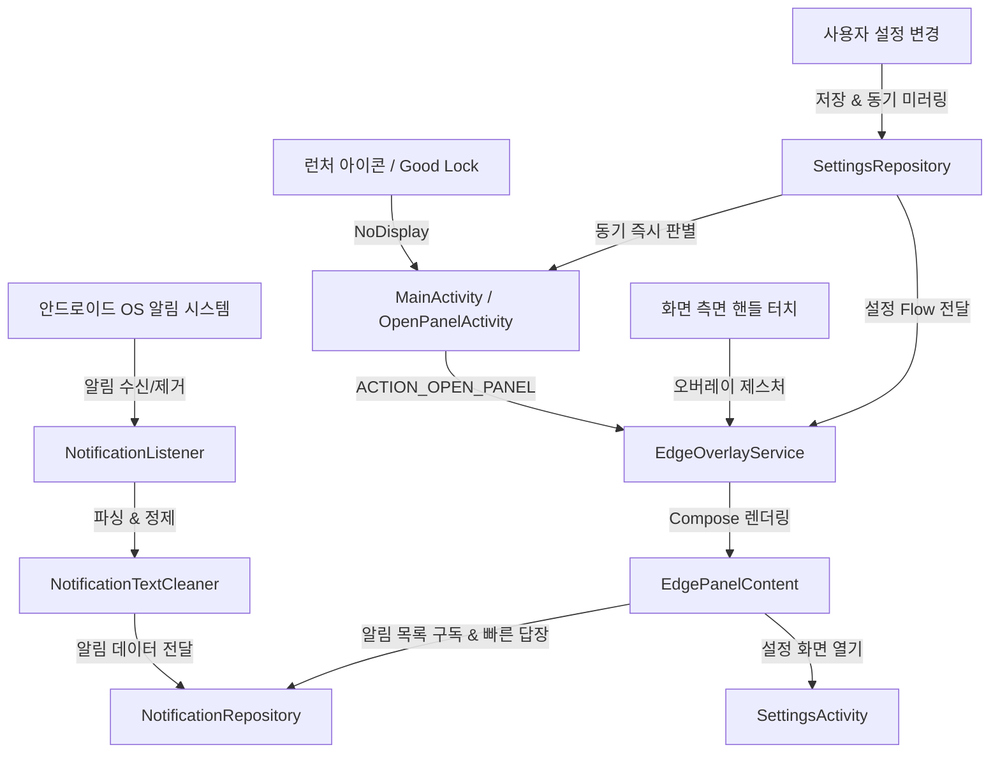

# 📘 Notification Edge 개발 참조 및 아키텍처 가이드 (Development Reference)

이 문서는 **Notification Edge** 프로젝트의 구조, 주요 컴포넌트 아키텍처, 지금까지 해결한 트러블슈팅 내역, 빌드 및 배포 절차, 향후 기능 개발 시 반드시 지켜야 할 주의사항을 정리한 종합 가이드입니다.

---

## 🏗 1. 핵심 아키텍처 및 컴포넌트 구조



### 📁 주요 파일 및 역할

| 파일 경로 | 주요 역할 및 설명 |
| :--- | :--- |
| **`service/EdgeOverlayService.kt`** | `TYPE_APPLICATION_OVERLAY` 기반의 화면 측면 투명 핸들(`handleView`), 엣지 패널(`panelComposeView`), 엣지 라이팅(`lightingComposeView`)을 관리하는 백그라운드 포그라운드 서비스. |
| **`service/NotificationListener.kt`** | `NotificationListenerService` 구현체. Ongoing/미디어 알림 필터링, 대화형 알림(`MessagingStyle`) 파싱, `Person` 객체 추출 및 `NotificationRepository`로 전달. |
| **`data/repository/NotificationRepository.kt`** | 수신된 알림의 메모리 캐시(`StateFlow`), 알림 삭제/취소 콜백, 빠른 답장(`RemoteInput` 전송) 및 가상 내 메시지 목록 생성/유지. |
| **`data/repository/SettingsRepository.kt`** | DataStore Preferences 기반 앱 설정 관리. 런처 즉시 판별을 위해 `SharedPreferences`(`notification_edge_sync_prefs`)에 동기 미러링 제공(`isLaunchDirectToPanelSync`). |
| **`util/NotificationTextCleaner.kt`** | 본문 텍스트 내 중복 발신자/전화번호 접두어(`홍길동: `, `010-XXXX-XXXX: ` 등) 무조건 잘라내기 및 단체방 참여자 명단 포맷팅 유틸리티. |
| **`util/CustomFontManager.kt`** | 사용자 기기 내 폰트 파일(`.ttf`, `.otf`, `.ttc`)을 SAF로 복사, 검증, 저장 및 로드하는 폰트 매니저. |
| **`ui/overlay/EdgePanelContent.kt`** | 엣지 패널의 Compose UI. 알림 카드 목록, 1:1 대화 및 그룹 채팅 분리 렌더링, 빠른 답장 입력창, 바깥 터치/드래그 닫기 처리. |
| **`ui/overlay/OverlayPanelLayout.kt`** | WindowManager 오버레이 창에서 안드로이드 뒤로가기(`KEYCODE_BACK`) 및 제스처 뒤로가기를 100% 가로채기 위한 커스텀 FrameLayout (`dispatchKeyEventPreIme` 포함). |
| **`MainActivity.kt`** | `Theme.NoDisplay` 기반의 런처 트램펄린 액티비티. 윈도우 생성 없이 0ms 만에 엣지 서비스를 띄우고 즉시 종료. |
| **`ui/settings/SettingsActivity.kt`** | 앱 설정 화면 전용 액티비티. 엣지 패널 상단의 [⚙️ 설정] 버튼을 눌렀을 때만 열림. |
| **`ui/OpenPanelActivity.kt`** | Good Lock 및 외부 숏컷 전용 `Theme.NoDisplay` 액티비티. |
| **`service/OpenPanelReceiver.kt`** | Good Lock, Tasker, 자동화 앱에서 브로드캐스트로 엣지 패널을 여닫는 리시버 (`com.devdooly.notificationedge.OPEN_PANEL`). |

---

## 🛠 2. 지금까지 해결한 주요 트러블슈팅 내역

### 1) 사용자 커스텀 폰트(.ttf, .otf) 직접 업로드 및 적용 (`v1.2.8`)
* **문제**: 프리셋 폰트에서 한글과 영문 혼용 시 줄 높이(Line Height) 불일치 발생 및 사용자 원하는 폰트 미지원.
* **해결**: SAF(Storage Access Framework) 파일 피커를 통해 기기 내 폰트를 앱 내부 저장소(`files/fonts/`)로 복사 후 `FontFamily(Font(File))`로 실시간 로드.

### 2) 미디어 재생 중단 방지 & 미디어 컨트롤 알림 필터링 (`v1.2.9`)
* **문제**: 유튜브나 음악 앱 재생 중 알림 패널을 열거나 알림을 탭하면 음악이 멈추는 현상.
* **해결**: `NotificationRepository`에서 `FLAG_ACTIVITY_RESET_TASK_IF_NEEDED` 제거, `NotificationListener`에서 `CATEGORY_TRANSPORT` 및 `EXTRA_MEDIA_SESSION` 알림 자동 제외.

### 3) 런처/Good Lock 실행 시 유튜브 PiP 팝업 방지 아키텍처 (`v1.3.0` ~ `v1.3.3`)
* **문제**: 일반 Activity가 실행되면 안드로이드 OS가 유튜브에게 `onUserLeaveHint()`를 발송하여 PiP 모드로 전환됨.
* **해결**: `MainActivity`를 `Theme.NoDisplay` 무화면 트램펄린으로 변경하고, 무거운 설정 화면을 `SettingsActivity`로 완전 분리. 미해결 과제는 [`docs/PENDING_ISSUES.md`](PENDING_ISSUES.md)에 체계적으로 기록.

### 4) 메시지 본문 발신자/전화번호 중복 제거 및 단체방 참여자 명확화 (`v1.3.4`, `v1.3.5`, `v1.3.7`)
* **문제**: 상단 타이틀에 이미 "홍길동"이 있는데, 본문에도 "홍길동: 안녕하세요"가 중복 출력되던 현상.
* **해결**: 
  - `NotificationTextCleaner`에 모든 형태의 발신자 콜론(`홍길동: `, `김철수 : `), 대괄호(`[홍길동] `), 전화번호 접두어를 무조건 잘라내는 룰 적용.
  - 1:1 대화에서는 UI에서 발신자 라벨 자체를 생략하고, 단체방에서만 화자 식별 라벨을 표시하도록 개선.

### 5) 뒤로가기(Back) 제스처/버튼 패널 닫힘 100% 보장 아키텍처 (`v1.4.0`)
* **문제**: 
  - `Service`의 `WindowManager.addView` 기반 오버레이 윈도우는 안드로이드 OS(특히 삼성 One UI / Android 10~14)의 제스처 네비게이션 및 하단 소프트키 Back 버튼 신호를 WMS 레벨에서 온전히 독점하지 못하고 포그라운드 액티비티로 흘려보내는 근본적 한계가 존재.
* **해결 (`v1.4.0`)**: 
  - **`EdgePanelActivity` (완전 투명 무애니메이션 호스트 액티비티) 도입**:
    - `Theme.NotificationEdge.TranslucentPanel` 적용 (배경 완전 투명, 윈도우 전환 애니메이션 없음).
    - 액티비티 레벨에서 `onBackPressedDispatcher.addCallback` 및 Compose `BackHandler`를 바인딩하여 **소프트키 뒤로가기, 화면 가장자리 스와이프 제스처, 바깥 영역 터치 시 100.0% 즉각 닫힘 보장**.
    - 핸들 터치 및 바로가기 실행 시 `EdgePanelActivity`가 0ms로 실행되어 완벽한 안드로이드 포그라운드 수명주기 획득.
### 6) GitHub Actions CI/CD 및 Gradle 빌드 속도 50% 이상 단축 최적화
* **원인**: 
  - `main` 브랜치와 `v*` 태그 동시 푸시 시 GitHub Actions 러너가 2개 동시 실행되어 대기열(Queueing) 및 리소스 경합 발생.
  - `gradle.properties`에 빌드 캐시(`caching`), 병렬 컴파일(`parallel`), 메모리 최적화 옵션이 꺼져 있어 매번 클린 빌드 수행.
  - `assembleRelease` 시 Android Lint(`lintVitalRelease`) 검사로 인한 지연.
* **해결**: 
  - `concurrency` 그룹 설정으로 중복 빌드 즉시 취소.
  - `gradle/actions/setup-gradle@v4` 및 `org.gradle.caching=true`, `org.gradle.parallel=true`, 4GB G1GC 메모리 최적화 적용.
  - `./gradlew testDebugUnitTest assembleRelease` 단일 파이프라인 통합 및 `lint { checkReleaseBuilds = false }` 적용으로 릴리즈 시간 획기적 단축.

---

## 💻 3. 표준 빌드, 버전 관리 및 Git 릴리즈 명령어

### 1) 버전 판올림 체크리스트
버전을 올릴 때는 다음 2개 파일(총 4곳)의 버전을 동시에 수정합니다:
1. `app/build.gradle.kts`: `versionCode`, `versionName`
2. `app/src/main/java/com/devdooly/notificationedge/ui/settings/SettingsScreen.kt`:
   - TopAppBar 버전 뱃지 (예: `v1.3.7`)
   - `AppUpdateCard(currentVersionName = "1.3.7")`
   - `AppInfoCard` (예: `버전 1.3.7 (Build 37) | Target Android 14`)

### 2) 테스트 및 빌드 검증 명령어
```bash
# 로컬 JVM 단위 테스트 실행
./gradlew testDebugUnitTest

# 디버그 & 릴리즈 빌드 검증
./gradlew compileDebugKotlin assembleRelease
```
*(테스트 및 빌드가 성공(`BUILD SUCCESSFUL`)하는지 반드시 확인)*

### 3) Git 커밋, 태그 생성 및 원격 자동 푸시
```bash
git add .
git commit -m "타입: 한글 설명(v버전)"
git tag -a v버전 -m "Release v버전: 상세 설명"
git push origin main
git push origin v버전
```

---

## 🧪 4. 테스트 환경 및 스위트 구조

프로젝트에는 다음과 같은 로컬 JVM 단위 테스트 및 계측 테스트 환경이 구축되어 있습니다:

| 테스트 클래스 | 테스트 대상 및 내용 |
| :--- | :--- |
| **`NotificationTextCleanerTest`** | 1:1 대화 발신자 접두어(`홍길동: `), 전화번호 접두어, 대괄호(`[Web발신]`), 단체방 긴 제목 포맷팅 정제 룰 검증 |
| **`AppUpdateManagerTest`** | 시맨틱 버전 비교 로직(`isNewerVersion`) 무결성 검증 |
| **`EdgeNotificationTest`** | 알림 엔티티 기본값, 메시지 모델, 빠른 답장 액션 플래그 검증 |
| **`AppSettingsTest`** | 앱 설정 기본값(패널 크기, 투명도, 엣지 라이팅 등) 검증 |
| **`SettingsRepositoryTest`** | Robolectric 기반 DataStore 및 SharedPreferences 동기화 동작 검증 |

> [!TIP]
> GitHub Actions CI 파이프라인(`.github/workflows/release.yml`)에 `testDebugUnitTest`가 자동 연동되어 있어, main 푸시 및 릴리즈 태그 생성 시 단위 테스트가 자동으로 실행 및 검증됩니다.

---

## ⚠️ 4. 향후 개발 시 주의사항 및 핵심 원칙

1. **커밋 메시지 및 마크다운 파일은 반드시 한글로 작성할 것** (사용자 글로벌 룰).
2. **코드 변경 및 빌드 검증 후 git commit 및 원격 저장소 push를 자동으로 진행할 것**.
3. **오버레이 윈도우(`WindowManager`) 수정 시 주의**:
   - `FLAG_NOT_FOCUSABLE`을 적용하면 시스템의 `KEYCODE_BACK`(뒤로가기 키/제스처)이 오버레이 창으로 들어오지 않습니다.
   - 키보드 입력이나 뒤로가기 처리가 필요할 때는 `OverlayPanelLayout`의 `dispatchKeyEvent` 및 `dispatchKeyEventPreIme`가 정상 동작하는지 항상 검증할 것.
4. **알림 텍스트 처리 시 주의**:
   - 새로운 메신저/앱 알림을 파싱할 때는 반드시 `NotificationTextCleaner.cleanMessageText`를 통과시켜 중복 접두어가 붙지 않도록 할 것.
