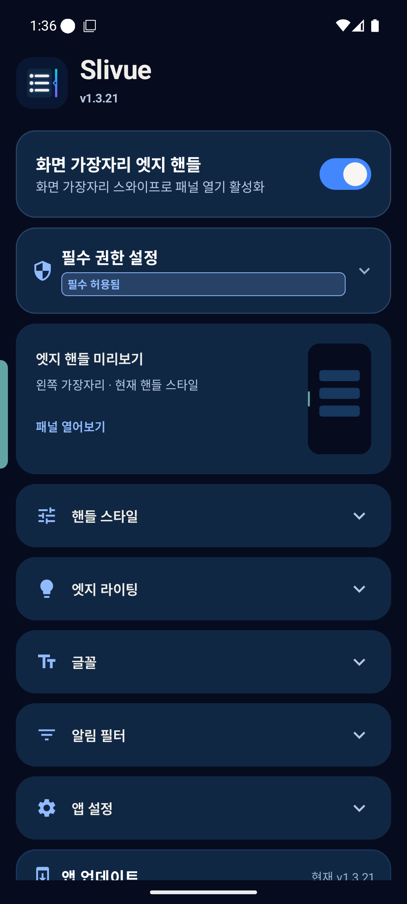
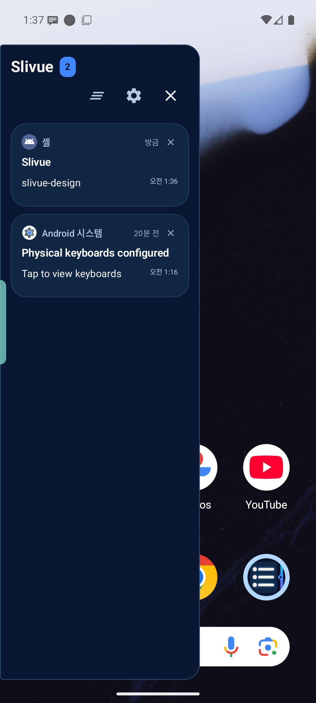

# Slivue 미드나이트 레일 디자인

2026-09-10 선택된 1번 시안을 v1.3.21에 반영한다. 아이콘은 교체하지 않고 기존 슬라이딩 패널 심볼과 네이비 팔레트를 앱 전체에 연결한다.

## 색상과 읽기

| 역할 | 색상 |
| --- | --- |
| 전체 배경 | `#060B1E` |
| 알림 패널·내부 영역 | `#0A1733` |
| 설정·알림 카드 | `#102744` |
| 보조 표면 | `#17385F` |
| 주요 동작 | `#4387FF` |
| 기본 글자 | `#F0EEE9` |
| 보조 글자 | `#B6C7DF` |
| 작은 보조 문구 | `#9BADCA` |
| 강조 글자 | `#91BBFF` |

브랜드 블루와 작은 글자용 블루는 구분한다. 주요 텍스트 토큰은 카드 배경에서 대비 4.5:1 이상을 자동 검사한다. 아이콘의 청록·보라 그라데이션을 모든 표면에 반복하지 않고 카드에는 불투명 네이비를 사용한다.

## 화면 구조

- 설정: 브랜드 → 핸들 켜기/끄기 → 권한 → 현재 핸들 미리보기 → 핸들 스타일·라이팅·글꼴·필터·앱 설정 메뉴 → 앱 업데이트.
- 앱 설정 안에는 기존 Good Lock·외부 명령·동작·진단·앱 정보를 보존한다.
- 각 메뉴는 접기/펼치기만 제공하며 저장된 설정값을 초기화하지 않는다. 메뉴의 펼침 상태는 저장 가능한 Compose 상태로 관리한다.
- 미리보기는 실제 핸들 설정을 반영한다. 기존 핸들 색이나 위치를 시안의 오른쪽 그라데이션으로 강제 변경하지 않는다.
- 패널과 답장 바는 기존 상태·이벤트를 그대로 사용한다. 답장 미지원 알림에 답장 기능을 추가하지 않는다.
- 좁은 패널에서는 헤더 버튼을 다음 줄로 이동해 제목과 터치 영역의 충돌을 막는다.

## 검증 범위

자동 검사는 번역 키·포맷, 기존 알림/설정/권한 회귀, 신규 메뉴 상태 복원·콜백·대비·큰 글꼴 버튼 배치를 포함한다.

Android 16 가상 기기 확인은 순정 Android 화면 확인이며, 삼성 One UI·Good Lock·실제 메신저의 장시간 동작까지 검증한 것은 아니다. 기존 [One UI 체크리스트](ONE_UI_RELEASE_CHECKLIST.md)는 별도 수행한다. 본 변경은 Google Play용 SDK·정책 대응 작업이 아니다.

## 확인 결과

- 최종 `testDebugUnitTest compileDebugKotlin lintRelease assembleRelease assembleMinifiedRelease assembleDebugAndroidTest` 성공. 단위/Compose 회귀 검사 162개, 실패 0개. Lint 오류 0개, 기존 경고 63개.
- 일반·축소 APK의 기존 서명 계보 및 인증서 확인 완료.
- Android 16 가상 기기의 기존 v1.3.20 위 업데이트, 한국어·영어 설정 화면, 메뉴 펼침/접힘, 패널 열기/뒤로가기, 테스트 알림 수신 확인. 검사 시 충돌 버퍼에 앱 충돌 없음.
- 아래는 생성 시안이 아닌 가상 기기 캡처다. 시스템 알림과 합성 시험 알림만 포함한다.

| 설정 화면 | 알림 패널 |
| --- | --- |
|  |  |
