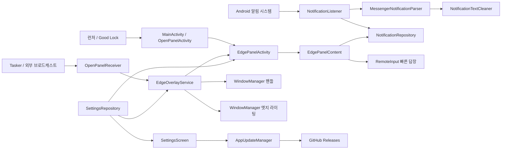

# Notification Edge 프로젝트 구조·소스 분석 및 개선 계획

> 기준일: 2026-09-04
> 분석 기준 커밋: `8b8573a` (`v1.3.13`, Build 143)
> 분석 범위: 현재 체크아웃의 앱 소스, 테스트, Android 매니페스트, Gradle 설정, GitHub Actions 및 기존 개발 문서
> 문서 목적: 이후 소스 수정과 보안 강화 작업에서 공통 기준으로 사용할 현행 구조 분석서와 실행 계획 제공

---

## 1. 핵심 요약

Notification Edge는 다음 세 축으로 동작하는 단일 모듈 Android 앱이다.

1. `NotificationListenerService`가 시스템 알림을 수신하고 앱별 파서로 정제한다.
2. `EdgeOverlayService`가 화면 가장자리 핸들과 엣지 라이팅을 `WindowManager` 오버레이로 유지한다.
3. 실제 알림 패널은 투명한 `EdgePanelActivity`가 호스팅해 시스템 뒤로가기와 키보드 입력을 처리한다.

현재 구조는 오버레이와 패널 호스트를 분리한 점, 알림 파서를 테스트 가능한 유틸리티로 분리한 점, DataStore를 설정의 기준 저장소로 사용한 점이 강점이다. 반면 릴리스 서명키 노출, 민감한 알림 원문 덤프, 외부 공개 브로드캐스트, GitHub Actions 릴리스 권한과 같은 보안 위험을 먼저 처리해야 한다. 그다음 알림 수신 콜백의 동기식 중량 작업, 전역 저장소의 수명주기 결합, 대형 Compose 파일, 설정 복구 및 백업 문제를 단계적으로 개선하는 것이 안전하다.

가장 중요한 원칙은 다음과 같다.

- `EdgeOverlayService`는 핸들과 라이팅만 담당하고, 패널은 계속 `EdgePanelActivity`가 호스팅한다.
- 보안 키 교체는 기존 설치본의 업데이트 경로를 확인한 후 진행한다.
- 알림 파서 변경은 현재 598줄의 파서 회귀 테스트를 보존하면서 사례를 추가하는 방식으로 수행한다.
- 대규모 리팩터링 전에 보안·동작 회귀 테스트를 먼저 추가한다.
- 기존 `DEVELOPMENT_REFERENCE.md`의 설명보다 이 문서가 분석한 현재 소스를 우선한다.

### 1.1 구현 진행 현황 (`v1.3.15`, Build 145)

2026-09-04 기준으로 우선순위가 높은 개선 항목은 다음과 같이 반영했다.

| 구분 | 상태 | 반영 내용 |
| :--- | :---: | :--- |
| 서명 비밀 분리 | 완료 | 키스토어 추적 제거, 평문 Gradle 비밀번호 제거, 로컬 속성/GitHub Secrets 전환 |
| CI 최소 권한·공급망 | 완료 | 검증/배포 Job 분리, 태그 전용 Release, Action SHA 고정, Dependabot 추가 |
| 개인정보 진단 덤프 | 완료 | 기본 비활성 옵트인, 민감정보 마스킹, 크기 제한, 민감 클립보드 적용 |
| 외부 브로드캐스트 | 완료 | 기본 거부 옵트인, 명령 화이트리스트, 권한 미보유 시 설정 화면 강제 실행 제거 |
| 알림 처리 경합 | 완료 | 크기 제한 직렬 이벤트 큐, 종료 시 콜백 해제, 메시지 병합 키 보강 |
| 설정 복구·백업 | 완료 | DataStore 손상/입출력 복구와 실제 설정 파일 백업 규칙 추가 |
| 업데이트 검증 | 완료 | HTTPS 호스트·리다이렉트·크기·체크섬·패키지·버전·서명 검증 |
| 중복 실행 정책 | 완료 | `OverlayServiceStarter`, `EdgePanelLauncher`로 공통화 |
| 버전 표시 | 완료 | `BuildConfig`와 런타임 Target SDK를 단일 기준으로 사용 |
| 자동 품질 게이트 | 완료 | 단위 테스트, 디버그 컴파일, Lint, 릴리스 빌드, APK 인증서 대조 |
| Compose 구조 분리 | 완료 | 설정 화면을 기능별 카드와 `SettingsViewModel`로 분리하고 패널 상태·헤더·카드·답장 바를 독립 파일로 분리 |
| 설정 목록 성능 | 완료 | 전체 `Column.verticalScroll`을 안정적인 key를 가진 `LazyColumn` 항목으로 전환 |
| R8 단계 검증 | 완료 | 배포 `release`는 유지하면서 R8·리소스 축소 전용 `minifiedRelease`와 CI 서명 검증 추가 |
| API 자동 매트릭스 | 구성 완료 | API 26·31·34·35 Gradle Managed Device 주간·수동 워크플로 및 컴포넌트 보안 계측 테스트 추가 |
| 수동 배포 게이트 | 문서화 완료 | One UI 회귀 체크리스트와 서명키 교체 실행서를 별도 문서로 추가 |

남은 작업은 호환성과 배포 정책 결정이 필요한 항목이다.

- 공개 Git 기록에 남은 기존 서명키 제거와 원격 이력 재작성
- 기존 설치본 업데이트 호환성을 고려한 새 서명키 전환 전략
- API 26·31·34·35 원격 Managed Device 실행 결과 확인
- `minifiedRelease`의 삼성 One UI 실기기 회귀 검증과 배포 `release` 승격

기존 자체 배포 APK와의 업데이트 호환성을 보존하기 위해 이번 릴리스는 기존 인증서를 CI 비밀 저장소에서 사용한다. 따라서 서명키 노출 위험은 저장소 최신 상태에서 차단했지만, 공개 Git 기록에 이미 노출된 키 자체가 안전해진 것은 아니다.

---

## 2. 현재 기준과 문서 불일치

현재 Git 상태는 `main`과 `origin/main`이 일치하며 작업 트리는 분석 시작 시점에 깨끗했다.

기존 [`DEVELOPMENT_REFERENCE.md`](DEVELOPMENT_REFERENCE.md)에는 현재 소스에 없는 `OverlayPanelLayout.kt`, 현재 태그보다 높은 `v1.4.x` 변경 이력, 과거 `EdgeOverlayService`가 패널까지 직접 렌더링한다는 설명이 함께 남아 있다. 따라서 다음 작업 전에는 문서의 과거 이력과 현행 구조를 구분해야 한다.

현행 소스의 사실은 다음과 같다.

- 현재 릴리스 후보: `v1.3.15`, `versionCode = 145`
- 패널 호스트: `EdgePanelActivity`
- 오버레이 서비스 책임: 핸들 및 엣지 라이팅
- 기본 핸들 방향: `LEFT`
- 기본 패널 너비: `260dp`
- 존재하지 않는 현행 파일: `OverlayPanelLayout.kt`

---

## 3. 기술 스택과 빌드 구성

| 구분 | 현재 구성 | 비고 |
| :--- | :--- | :--- |
| 언어 | Kotlin 2.0.21 | JVM Target 17 |
| Android Gradle Plugin | 8.6.0 | Gradle Wrapper 8.14 |
| 최소 SDK | 26 | Android 8.0 |
| 컴파일/대상 SDK | 34 / 34 | Android 14 기준 |
| UI | Jetpack Compose, Material 3 | Compose BOM 2024.10.00 |
| 비동기 처리 | Kotlin Coroutines 1.9.0 | 서비스별 자체 `CoroutineScope` 사용 |
| 설정 저장 | Preferences DataStore 1.1.1 | 일부 설정은 SharedPreferences에 동기 미러링 |
| 테스트 | JUnit4, MockK, Turbine, Robolectric, AndroidX Test | JVM 테스트 56개, 계측 테스트 1개 |
| 배포 | GitHub Actions + GitHub Releases | `main`은 검증만, `v*` 태그는 검증 후 배포 |

분석 후 공식 Android 명령줄 도구와 SDK 34를 설치해 로컬 빌드 환경을 복구했다. `v1.3.15` 구현 결과는 `testDebugUnitTest`, `compileDebugKotlin`, `assembleDebugAndroidTest`, `lintRelease`, `assembleRelease`, `assembleMinifiedRelease`와 `apksigner verify`로 다시 검증한다.

---

## 4. 디렉터리 구조

```text
message_edge/
├─ .agents/skills/                 # 프로젝트 전용 개발·테스트·배포 지침
├─ .github/workflows/
│  └─ release.yml                  # 테스트, 릴리스 APK 빌드, GitHub Release 생성
├─ app/
│  ├─ build.gradle.kts             # 앱/서명/빌드 타입/의존성 설정
│  ├─ keystore/                    # 로컬 전용 릴리스 키 위치(Git 추적 제외)
│  └─ src/
│     ├─ main/
│     │  ├─ AndroidManifest.xml
│     │  ├─ java/com/devdooly/notificationedge/
│     │  │  ├─ data/
│     │  │  │  ├─ model/           # 설정 및 알림 데이터 모델
│     │  │  │  ├─ repository/      # 설정/알림 상태와 동작
│     │  │  │  └─ updater/         # GitHub Release 조회·APK 설치
│     │  │  ├─ service/            # 알림 리스너, 오버레이 서비스, 리시버
│     │  │  ├─ ui/
│     │  │  │  ├─ overlay/         # 패널 Activity/Compose UI/라이팅
│     │  │  │  ├─ settings/        # 설정 Activity/Compose UI
│     │  │  │  └─ theme/           # 색상, 타이포그래피, 폰트
│     │  │  └─ util/               # 파서, 정제, 폰트, 미디어, 수명주기 보조
│     │  └─ res/                    # 테마, 아이콘, FileProvider/백업 규칙
│     ├─ test/                      # JVM/Robolectric 단위·회귀 테스트
│     └─ androidTest/               # 기기 계측 테스트
├─ docs/                            # 설계, UI 명칭, 미해결 이슈 및 본 문서
├─ gradle/libs.versions.toml        # 버전 카탈로그
└─ README.md
```

---

## 5. 런타임 아키텍처



### 5.1 앱 실행과 패널 토글

1. 런처는 [`MainActivity.kt`](../app/src/main/java/com/devdooly/notificationedge/MainActivity.kt)를 실행한다.
2. 오버레이 권한과 `launchDirectToPanel` 동기 설정을 확인한다.
3. 패널이 열려 있으면 닫고, 아니면 `EdgePanelActivity`를 시작한다.
4. `MainActivity`는 즉시 종료해 트램펄린 역할만 수행한다.
5. `EdgePanelActivity`는 투명 테마와 `OnBackPressedDispatcher`를 사용해 패널을 호스팅한다.

`OpenPanelActivity`도 거의 같은 토글 로직을 중복 구현한다. 외부 브로드캐스트 경로는 `OpenPanelReceiver`가 `EdgeOverlayService`에 명령 액션을 전달하고, 서비스가 `EdgePanelActivity`를 연다.

### 5.2 오버레이 서비스

[`EdgeOverlayService.kt`](../app/src/main/java/com/devdooly/notificationedge/service/EdgeOverlayService.kt)는 포그라운드 서비스이며 다음을 관리한다.

- `TYPE_APPLICATION_OVERLAY` 기반 엣지 핸들
- 탭 또는 방향성 스와이프 감지
- 새 알림 이벤트에 따른 전체 화면 비터치 엣지 라이팅
- 설정 Flow 구독 및 핸들 재배치
- 패널 열기·닫기·토글 명령

핸들은 `FLAG_NOT_FOCUSABLE`을 유지하므로 배경 앱의 입력을 과도하게 차단하지 않는다. 키보드와 시스템 뒤로가기가 필요한 패널을 별도 Activity로 분리한 구조는 유지해야 한다.

### 5.3 알림 수신과 정제

[`NotificationListener.kt`](../app/src/main/java/com/devdooly/notificationedge/service/NotificationListener.kt)는 다음 순서로 처리한다.

1. 자기 앱, 지속 알림, 그룹 요약, 미디어 서비스 알림을 제외한다.
2. 사용자 제외 패키지와 차단 키워드를 적용한다.
3. Ranking, Shortcut, NotificationChannel, Ticker, RemoteViews 텍스트를 수집한다.
4. 카카오톡 전용 또는 일반 메신저 파서로 분기한다.
5. 빠른 답장 `RemoteInput` 액션과 앱 메타데이터를 추출한다.
6. 원본 Extras 디버그 덤프를 생성한다.
7. `NotificationRepository`에 병합하고 새 알림 이벤트를 발행한다.

[`MessengerNotificationParser.kt`](../app/src/main/java/com/devdooly/notificationedge/util/MessengerNotificationParser.kt)는 카카오톡, 인스타그램, Telegram, Line, Discord, 문자 계열 및 일반 알림을 분기한다. 카카오톡은 Shortcut 라벨, 대화 제목, `subText`, 채널명, Ticker, Extras, RemoteViews 순으로 방 이름을 추론한다.

### 5.4 알림 상태와 빠른 답장

[`NotificationRepository.kt`](../app/src/main/java/com/devdooly/notificationedge/data/repository/NotificationRepository.kt)는 프로세스 메모리의 전역 `StateFlow`로 최대 150개의 알림 카드와 카드당 최대 50개의 메시지를 유지한다.

- 같은 알림 키 또는 같은 대화로 판단되면 메시지를 병합한다.
- 시스템 상태바에서 지워진 알림은 `isDismissed`로 보관한다.
- 카드 삭제와 모두 지우기는 `NotificationListener`가 등록한 전역 콜백으로 시스템 알림까지 취소한다.
- 빠른 답장은 `RemoteInput`으로 보내고, 전송 성공 시 화면에 내 메시지를 즉시 추가한다.
- 프로세스가 종료되면 알림 기록은 사라진다.

### 5.5 설정과 UI

[`SettingsRepository.kt`](../app/src/main/java/com/devdooly/notificationedge/data/repository/SettingsRepository.kt)는 Preferences DataStore를 설정의 주 저장소로 사용한다. 런처에서 코루틴 대기 없이 읽어야 하는 `launchDirectToPanel`만 SharedPreferences에도 복제한다.

초기 분석 시 [`SettingsScreen.kt`](../app/src/main/java/com/devdooly/notificationedge/ui/settings/SettingsScreen.kt)는 약 2천 줄의 단일 파일이었다. 현재는 약 220줄의 조립 화면, `SettingsViewModel`, 기능별 카드 파일로 분리됐고 목록은 `LazyColumn`으로 렌더링한다.

초기 분석 시 [`EdgePanelContent.kt`](../app/src/main/java/com/devdooly/notificationedge/ui/overlay/EdgePanelContent.kt)는 약 1천 줄이었다. 현재는 약 310줄의 화면 조립부와 `EdgePanelUiState`, `PanelHeader`, `NotificationCard`, `KeyboardFloatingReplyBar`로 분리됐다.

### 5.6 인앱 업데이트와 배포

[`AppUpdateManager.kt`](../app/src/main/java/com/devdooly/notificationedge/data/updater/AppUpdateManager.kt)는 GitHub 최신 Release API를 조회하고 첫 번째 APK 자산을 내려받아 `FileProvider`로 패키지 설치 화면을 연다.

GitHub Actions는 JVM 테스트와 `assembleRelease`를 수행한 뒤 `main` 푸시에는 `latest`, 태그 푸시에는 해당 버전 이름으로 Release를 생성하거나 갱신한다.

---

## 6. 주요 컴포넌트 책임표

| 컴포넌트 | 현재 책임 | 유지/개선 방향 |
| :--- | :--- | :--- |
| `MainActivity` | 런처 트램펄린, 설정/패널 분기 | 토글 중복을 공통 실행기로 추출 |
| `OpenPanelActivity` | 외부 바로가기 트램펄린 | `MainActivity`와 공통 실행 정책 사용 |
| `EdgePanelActivity` | 투명 패널 호스트, 시스템 바, 뒤로가기, 키보드 | 현 아키텍처 유지, 패널 세션 상태 캡슐화 |
| `EdgeOverlayService` | 핸들, 라이팅, 포그라운드 서비스, 패널 명령 | 패널 직접 렌더링 금지, 서비스 명령과 Window 책임 분리 |
| `OpenPanelReceiver` | 외부 앱의 열기/닫기/토글 | 외부 공개 정책과 인증/옵트인 결정 필요 |
| `BootReceiver` | 부팅 후 서비스 복구 | Android 15+ 시작 조건과 실패 처리 보강 |
| `NotificationListener` | 수신, 필터, 메타데이터 추출, 파싱, 덤프 | 수신 콜백 경량화, 덤프 분리, 수명주기 정리 |
| `MessengerNotificationParser` | 앱별 방/발신자/본문 추론 | 테스트 우선 유지, 규칙 테이블화 검토 |
| `NotificationTextCleaner` | 중복 접두어 제거 | 모든 메시지 경로의 단일 정제 지점 유지 |
| `NotificationRepository` | 메모리 상태, 병합, 시스템 알림 취소, 답장 | 상태 저장과 Android 실행 동작을 인터페이스로 분리 |
| `SettingsRepository` | DataStore 설정, 동기 미러 | 읽기 오류 복구, 이중 저장 일관성 개선 |
| `AppUpdateManager` | Release 조회, APK 다운로드/설치 | 버전·호스트·크기·서명·해시 검증 추가 |
| `SettingsScreen` | 전체 설정 UI와 일부 플랫폼 동작 | 화면 상태와 플랫폼 동작을 ViewModel/컨트롤러로 이동 |
| `EdgePanelContent` | 패널/카드/답장/애니메이션 | 상태 호이스팅과 작은 컴포넌트 파일로 분리 |

---

## 7. 확인된 강점

- 핸들·라이팅 오버레이와 패널 Activity를 분리해 포커스와 뒤로가기 충돌을 줄였다.
- `MainActivity`가 무거운 Compose UI를 소유하지 않는 트램펄린 구조다.
- 카카오톡과 여러 앱의 실제 Extras 사례를 반영한 파서 테스트가 풍부하다.
- 알림 텍스트 정제와 대화 병합이 별도 함수로 분리되어 회귀 테스트가 가능하다.
- 설정 값은 쓰기 시 범위를 제한해 비정상 UI 값 저장을 방지한다.
- 인앱 업데이트 네트워크는 현재 `AppUpdateManager`의 GitHub API/자산 다운로드에 한정된다.
- `FileProvider`, 오버레이 서비스 및 내부 Activity는 필요한 범위에서 `exported=false`로 설정되어 있다.
- `specialUse` 포그라운드 서비스 타입과 대응 권한·설명 속성이 선언되어 Android 14 기본 요구사항을 충족한다.

---

## 8. 위험 및 개선 항목

우선순위는 `P0`이 즉시 차단·대응, `P1`이 다음 릴리스 전, `P2`가 안정화 단계, `P3`가 장기 구조 개선을 의미한다.

### 8.1 보안 및 개인정보

| ID | 우선순위 | 확인 내용 | 영향 | 주요 근거 |
| :--- | :---: | :--- | :--- | :--- |
| SEC-01 | P0 | 릴리스 키스토어가 Git에 포함되고 비밀번호가 Gradle에 평문으로 존재 | 제3자가 공식 앱과 동일한 서명으로 악성 APK를 만들 수 있음 | [`app/build.gradle.kts:21`](../app/build.gradle.kts#L21), `app/keystore/release.keystore` |
| SEC-02 | P1 | 모든 수신 알림의 전체 Extras 덤프를 생성하고 UI·클립보드로 노출 | 메시지, 연락처, OTP, 내부 식별자가 과도하게 보존·공유될 수 있음 | [`NotificationListener.kt:236`](../app/src/main/java/com/devdooly/notificationedge/service/NotificationListener.kt#L236), [`SettingsScreen.kt:455`](../app/src/main/java/com/devdooly/notificationedge/ui/settings/SettingsScreen.kt#L455) |
| SEC-03 | P1 | `OpenPanelReceiver`가 권한 없이 외부에 공개됨 | 임의 앱이 패널 토글, 진동, 서비스 시작, 설정 화면 노출을 유발할 수 있음 | [`AndroidManifest.xml:96`](../app/src/main/AndroidManifest.xml#L96), [`OpenPanelReceiver.kt:15`](../app/src/main/java/com/devdooly/notificationedge/service/OpenPanelReceiver.kt#L15) |
| SEC-04 | P1 | APK 다운로드가 URL, 응답 코드, MIME, 크기, 해시, 패키지명, 서명 인증서를 사전 검증하지 않음 | 손상 파일·과대 파일·잘못된 자산 처리 및 업데이트 공급망 방어 부족 | [`AppUpdateManager.kt:110`](../app/src/main/java/com/devdooly/notificationedge/data/updater/AppUpdateManager.kt#L110) |
| SEC-05 | P1 | GitHub Actions 전체에 `contents: write`가 있고 `main`도 Release를 갱신 | 일반 브랜치 빌드가 배포 상태를 바꾸며 워크플로 탈취 시 쓰기 범위가 큼 | [`.github/workflows/release.yml:11`](../.github/workflows/release.yml#L11) |
| SEC-06 | P2 | 릴리스 난독화/축소와 릴리스 Lint가 비활성화됨 | 불필요 코드 포함, 정적 경고 누락, 역공학 비용 감소 | [`app/build.gradle.kts:32`](../app/build.gradle.kts#L32), [`app/build.gradle.kts:54`](../app/build.gradle.kts#L54) |
| SEC-07 | P2 | 디버그 덤프 클립에 민감정보 플래그가 없음 | 키보드 클립보드 미리보기 등에서 원문이 노출될 수 있음 | [`EdgePanelContent.kt:947`](../app/src/main/java/com/devdooly/notificationedge/ui/overlay/EdgePanelContent.kt#L947) |
| SEC-08 | P2 | 사용자 폰트 파일에 최대 크기 제한과 canonical 경로 검증이 없음 | 매우 큰 파일에 의한 저장공간/메모리 압박, 변조된 설정값의 경로 이탈 가능성 | [`CustomFontManager.kt`](../app/src/main/java/com/devdooly/notificationedge/util/CustomFontManager.kt) |

Android 공식 문서는 앱 서명 개인키를 안전하게 보관하고 평문 서명 정보를 빌드 파일에서 분리하도록 권고한다. 공개 리시버는 외부 호출이 의도된 경우에도 접근 제어가 필요하며, 민감한 클립보드 데이터에는 민감정보 플래그를 설정해야 한다.

### 8.2 안정성 및 Android 버전 대응

| ID | 우선순위 | 확인 내용 | 영향 | 주요 근거 |
| :--- | :---: | :--- | :--- | :--- |
| REL-01 | P1 | `onNotificationPosted()`에서 Ranking/Shortcut 조회, RemoteViews 리플렉션, 앱 아이콘 로드, 전체 덤프 생성을 동기 수행 | 알림 폭주 시 리스너 지연, 프레임 저하 또는 ANR 위험 | [`NotificationListener.kt:83`](../app/src/main/java/com/devdooly/notificationedge/service/NotificationListener.kt#L83), [`NotificationListener.kt:159`](../app/src/main/java/com/devdooly/notificationedge/service/NotificationListener.kt#L159) |
| REL-02 | P1 | Android 15 타깃부터 `SYSTEM_ALERT_WINDOW`만으로 백그라운드 FGS 시작 예외를 받으려면 가시 오버레이가 필요 | 서비스가 죽은 상태의 외부 브로드캐스트에서 `ForegroundServiceStartNotAllowedException` 가능 | [`OpenPanelReceiver.kt:28`](../app/src/main/java/com/devdooly/notificationedge/service/OpenPanelReceiver.kt#L28) |
| REL-03 | P1 | 알림 취소 콜백이 전역 람다이며 `onDestroy()`에서 명시적으로 해제하지 않음 | 서비스 인스턴스 보존 또는 종료 뒤 잘못된 콜백 호출 가능 | [`NotificationListener.kt:40`](../app/src/main/java/com/devdooly/notificationedge/service/NotificationListener.kt#L40), [`NotificationRepository.kt:33`](../app/src/main/java/com/devdooly/notificationedge/data/repository/NotificationRepository.kt#L33) |
| REL-04 | P2 | DataStore 읽기 Flow에 `IOException` 복구가 없고 손상 처리기가 없음 | 저장소 읽기 오류가 설정 구독을 종료해 서비스 갱신이 멈출 수 있음 | [`SettingsRepository.kt:59`](../app/src/main/java/com/devdooly/notificationedge/data/repository/SettingsRepository.kt#L59) |
| REL-05 | P2 | `launchDirectToPanel`만 SharedPreferences에 별도 미러링 | 복원·이전 버전·부분 쓰기 실패에서 DataStore와 동기 값이 달라질 수 있음 | [`SettingsRepository.kt:118`](../app/src/main/java/com/devdooly/notificationedge/data/repository/SettingsRepository.kt#L118) |
| REL-06 | P2 | 백업 규칙이 SharedPreferences만 포함하고 `files/datastore/`를 제외 | 복원 후 대부분의 사용자 설정이 초기화될 수 있음 | [`backup_rules.xml`](../app/src/main/res/xml/backup_rules.xml), [`data_extraction_rules.xml`](../app/src/main/res/xml/data_extraction_rules.xml) |
| REL-07 | P2 | RemoteViews의 내부 필드 `mActions`를 리플렉션으로 읽음 | 제조사·Android 업데이트에서 조용히 기능 저하 가능 | [`NotificationListener.kt:306`](../app/src/main/java/com/devdooly/notificationedge/service/NotificationListener.kt#L306) |
| REL-08 | P2 | 미디어 정지 옵션이 서비스와 Activity에서 중복 실행됨 | 같은 패널 열기에 미디어 세션 탐색·정지 명령이 두 번 발생 | [`EdgeOverlayService.kt:310`](../app/src/main/java/com/devdooly/notificationedge/service/EdgeOverlayService.kt#L310), [`EdgePanelActivity.kt:60`](../app/src/main/java/com/devdooly/notificationedge/ui/overlay/EdgePanelActivity.kt#L60) |
| REL-09 | P2 | 메시지 중복 제거 키가 `timestamp + text`이고 발신자를 포함하지 않음 | 같은 시각·같은 문장의 서로 다른 발신자 메시지가 합쳐질 수 있음 | [`NotificationRepository.kt:53`](../app/src/main/java/com/devdooly/notificationedge/data/repository/NotificationRepository.kt#L53) |
| REL-10 | P2 | 최신 버전 비교가 버전 순서가 아니라 단순 불일치 비교임 | 현재 버전보다 낮은 Release도 업데이트로 표시 | [`AppUpdateManager.kt:99`](../app/src/main/java/com/devdooly/notificationedge/data/updater/AppUpdateManager.kt#L99) |

### 8.3 구조 및 유지보수성

| ID | 우선순위 | 확인 내용 | 개선 방향 |
| :--- | :---: | :--- | :--- |
| ARC-01 | P2 | `SettingsScreen.kt`가 약 2,046줄이며 플랫폼 호출과 UI 상태를 함께 소유 | 기능별 화면 파일과 `SettingsViewModel`/UI 상태로 분리 |
| ARC-02 | P2 | `EdgePanelContent.kt`가 약 1,033줄이며 애니메이션·키보드·목록·카드를 함께 소유 | 패널 상태 홀더, 카드, 답장 바, 헤더로 분리 |
| ARC-03 | P2 | `NotificationRepository`가 상태 저장, Android `PendingIntent`, 시스템 알림 취소, 앱 실행, 답장을 모두 담당 | 순수 상태 저장소와 플랫폼 실행 게이트웨이 분리 |
| ARC-04 | P2 | `MainActivity`, `OpenPanelActivity`, `EdgeOverlayService`에 패널 토글 코드가 중복 | `PanelLauncher` 또는 `PanelCommandHandler`로 통합 |
| ARC-05 | P2 | UI에 버전명과 빌드 번호가 세 번 하드코딩됨 | `BuildConfig.VERSION_NAME`과 `VERSION_CODE` 사용 |
| ARC-06 | P3 | 앱 설정 및 알림 UI 상태에 명시적 ViewModel 계층이 없음 | 수명주기, 테스트, 일회성 이벤트를 ViewModel에서 관리 |
| ARC-07 | P3 | `NotificationEdgeApp`이 비어 있고 의존성 조립 지점이 없음 | 수동 AppContainer 또는 DI 도입 시 조립 지점으로 사용 |
| DOC-01 | P1 | 기존 개발 문서의 버전과 클래스 설명이 현재 소스와 불일치 | 현행 구조/과거 이력을 분리하고 깨진 파일 참조 제거 |

---

## 9. 테스트 현황과 공백

### 9.1 현재 테스트 자산

- JVM/Robolectric 테스트 메서드: 45개
- 계측 테스트 메서드: 1개
- 강한 영역: `MessengerNotificationParser`, `NotificationTextCleaner`, 대화 병합, 설정 일부, 데이터 모델
- 약한 영역: Activity/서비스/리시버 수명주기, 권한별 동작, Compose UI, 업데이트 네트워크·파일 검증, 보안 경계

### 9.2 우선 추가할 회귀 테스트

| 테스트 계층 | 추가 대상 | 필수 사례 |
| :--- | :--- | :--- |
| 순수 단위 | 버전 비교기 | 동급, 상위, 하위, `v` 접두어, 프리릴리스, 잘못된 태그 |
| 순수 단위 | 알림 덤프 정제기 | OTP, 전화번호, 이메일, 토큰형 키, 중첩 Bundle 마스킹 |
| 순수 단위 | 대화 병합 키 | 같은 시각/본문의 서로 다른 발신자, 본인 답장 반사 알림 |
| 순수 단위 | 업데이트 검증기 | HTTPS/호스트 허용 목록, 크기 제한, MIME, 해시 불일치 |
| Robolectric | `SettingsRepository` | `IOException`, 초기 마이그레이션, 동기 미러 불일치, 백업 복원 |
| Robolectric | `NotificationListener` | 필터 순서, 콜백 등록·해제, 무거운 파싱의 작업 스레드 위임 |
| Robolectric | 리시버/서비스 | 권한 없음, 서비스 실행 제한 예외, 허용되지 않은 외부 호출 |
| Compose UI | 패널 | 바깥 터치, 1단계 키보드 닫기, 2단계 패널 닫기, 빠른 답장 |
| Compose UI | 설정 | 권한 상태, 설정 변경, 필터 추가·삭제, 디버그 모드 비활성 상태 |
| 기기 계측 | Android 8/12/14/15 | 오버레이 권한, 부팅 복구, 내비게이션 버튼/제스처, FGS 시작 제한 |
| 실기기 수동 | 삼성 One UI | Good Lock 실행, 전체화면 YouTube/PiP, 120Hz 스크롤, 키보드 `adjustResize` |

---

## 10. 단계별 소스 수정 및 보안 강화 계획

### 0단계: 배포·서명 의사결정과 복구 기준 확정

목표는 키 노출 대응 중 기존 사용자의 업데이트 경로를 실수로 끊지 않는 것이다.

- [ ] 저장소 공개 범위, 키가 포함된 최초 커밋, 배포 채널, 기존 설치본 수를 확인한다.
- [ ] Google Play App Signing 사용 여부와 현재 키가 앱 서명키인지 업로드 키인지 확인한다.
- [ ] Play App Signing 사용 시 노출된 업로드 키 재설정 절차를 선택한다.
- [ ] 자체 서명 APK 배포라면 Android 서명 계보를 이용한 키 회전 가능성과 구형 기기의 재설치 요구를 검토한다.
- [ ] 전환 계획이 확정될 때까지 현재 키를 공개 저장소에서 더 사용하지 않되, 기존 설치본용 마지막 전환 릴리스가 필요하면 오프라인 보관소에서만 제한적으로 사용한다.
- [ ] 키 회전 전 현재 인증서 SHA-256과 정상 APK 해시를 별도 안전 저장소에 기록한다.

완료 기준:

- 새 키/기존 키 사용 정책과 기존 사용자 마이그레이션 방법이 문서로 승인됨
- 키 폐기 또는 제한 보관 책임자와 위치가 결정됨
- 이후 단계에서 사용할 CI 비밀값 이름이 확정됨

### 1단계: 릴리스 키와 CI/CD 즉시 보강

대상 파일:

- `app/build.gradle.kts`
- `.gitignore`
- `.github/workflows/release.yml`
- `app/keystore/release.keystore`
- 신규 예시 파일 `keystore.properties.example`

작업:

- [x] 키스토어와 실제 `keystore.properties`를 Git 추적에서 제거하고 ignore 규칙을 추가한다.
- [x] 비밀번호를 환경변수 또는 로컬 `keystore.properties`에서만 읽는다.
- [x] CI에서는 GitHub Secrets의 Base64 키스토어를 작업 중 임시 파일로 복원하고 작업 후 폐기한다.
- [x] 디버그 빌드는 Android 기본 디버그 키를 사용하고 릴리스 빌드만 릴리스 키를 요구한다.
- [x] 릴리스 키가 없을 때 `assembleRelease`는 명확한 오류로 실패하게 한다.
- [x] 일반 검증 작업은 `contents: read`, 태그 Release 작업만 `contents: write`를 갖게 분리한다.
- [x] `main` 푸시는 테스트·빌드 산출물만 만들고 GitHub Release는 `v*` 태그에서만 생성하도록 변경한다.
- [x] 외부 GitHub Action은 커밋 SHA 고정과 Dependabot 갱신을 적용한다.
- [ ] 필요하면 Git 기록 정리와 GitHub 비밀 스캔 결과 확인을 별도 운영 작업으로 수행한다.

완료 기준:

- 저장소와 GitHub Actions 로그에 키 파일·비밀번호가 없음
- 로컬 디버그 빌드가 릴리스 키 없이 가능함
- CI 태그 빌드의 APK 서명 인증서가 승인된 지문과 일치함
- `main` 푸시가 Release 또는 태그를 변경하지 않음

### 2단계: 개인정보 덤프와 외부 진입점 보강

대상 파일:

- `NotificationListener.kt`
- `EdgeNotification.kt`
- `SettingsScreen.kt`
- `EdgePanelContent.kt`
- `OpenPanelReceiver.kt`
- `AndroidManifest.xml`

작업:

- [x] 알림 원본 덤프는 기본 비활성인 개발자 진단 모드에서만 생성한다.
- [ ] 진단 모드는 명확한 개인정보 경고와 만료 시간을 가진 사용자 옵트인으로 만든다.
- [x] 전화번호, 이메일, OTP, 토큰/인증/세션 관련 키와 긴 바이너리·배열을 마스킹하는 `NotificationDumpSanitizer`를 추가한다.
- [x] 덤프 길이, 항목 수, 중첩 깊이를 제한한다.
- [x] 클립보드에는 `ClipDescription.EXTRA_IS_SENSITIVE`를 설정하고 선택적으로 일정 시간 뒤 비운다.
- [x] 운영 UI의 알림 카드에서 디버그 복사 버튼을 기본 숨김 처리한다.
- [x] `OpenPanelReceiver`는 사용자 옵트인 외부 연동으로 유지한다.
  - 외부 연동이 불필요하면 `exported=false`로 전환한다.
  - Good Lock/Tasker 연동이 필수면 사용자 설정에서 외부 제어를 명시적으로 활성화하고, 허용 호출자·토큰·명령 범위를 설계한다.
  - 내부 앱 명령은 별도 비공개 경로로 분리한다.
- [x] 알 수 없는 액션을 기본 열기로 처리하지 말고 즉시 무시한다.
- [x] 권한이 없을 때 공개 리시버가 임의로 설정 Activity를 띄우지 않게 한다.

완료 기준:

- 기본 설정에서 알림 Extras 원문이 모델이나 UI에 존재하지 않음
- 진단 모드 덤프가 테스트된 마스킹·크기 제한을 통과함
- 외부 앱이 사용자 동의 없이 패널 또는 설정 화면을 실행할 수 없음

### 3단계: 서비스 수명주기와 알림 처리 안정화

대상 파일:

- `NotificationListener.kt`
- `NotificationRepository.kt`
- `EdgeOverlayService.kt`
- `EdgePanelActivity.kt`
- `BootReceiver.kt`
- `OpenPanelReceiver.kt`

작업:

- [x] `onNotificationPosted()`는 최소 검증과 불변 스냅샷만 수행하고, 순서가 보장되는 전용 작업 큐에서 파싱한다.
- [x] 앱 라벨·아이콘은 패키지 단위 LRU 캐시로 중복 조회를 줄인다.
- [ ] RemoteViews 리플렉션은 최후 수단으로 격리하고 API/제조사 실패 지표를 남긴다.
- [ ] 로그는 `printStackTrace()` 대신 태그·수준·민감정보 제거 정책이 있는 로거로 통일한다.
- [ ] `currentSettings` 접근을 `StateFlow.value` 또는 명확한 동시성 경계로 바꾼다.
- [x] 알림 취소 콜백을 `onDestroy()`에서도 해제한다.
- [x] 메시지 중복 키에 발신자와 `isFromUser`를 포함하고 상수 `MAX_MESSAGES_PER_NOTIFICATION`을 일관되게 사용한다.
- [x] YouTube 일시정지는 패널 열기 명령의 한 지점에서만 수행한다.
- [x] FGS 시작 제한 예외를 처리하고 실패 시 안전하게 중단한다.
- [x] 부팅 복구, 외부 명령, 설정 화면 시작 경로별 서비스 시작 정책을 하나의 `OverlayServiceStarter`로 통합한다.

완료 기준:

- 알림 수신 콜백에서 파일/리플렉션/패키지 조회를 직접 수행하지 않음
- 알림 100건 연속 입력 테스트에서 순서·병합·라이팅 정책이 유지됨
- 서비스 종료 후 전역 객체에 서비스 인스턴스 참조가 남지 않음
- API 31/34/35의 서비스 시작 제한 시 앱이 크래시하지 않음

### 4단계: 설정 저장 복구와 상태 계층 정리

대상 파일:

- `SettingsRepository.kt`
- `backup_rules.xml`
- `data_extraction_rules.xml`
- 신규 설정 마이그레이션/상태 클래스

작업:

- [x] `dataStore.data.catch`에서 `IOException`은 기본 Preferences로 복구하고 다른 예외는 재발생시킨다.
- [x] DataStore 손상 시 빈 Preferences로 복구하는 정책을 정의한다.
- [ ] `launchDirectToPanel`의 SharedPreferences 미러를 제거하거나 DataStore와 원자적으로 동기화되는 명시적 마이그레이션을 추가한다.
- [ ] 앱 시작 0ms 요구가 실제로 필요한지 측정하고, 필요하면 작은 전용 동기 설정 저장소의 소유권을 명확히 한다.
- [x] 백업 정책에서 실제 DataStore 경로를 포함하고 캐시·진단 데이터는 제외한다.
- [x] 설정 기본값은 `AppSettings`를 기준으로 DataStore fallback에 사용한다.

완료 기준:

- 읽기 오류·복원·업데이트 마이그레이션 테스트 통과
- 런처 동기 값과 설정 화면 값이 항상 일치함
- 백업 복원 뒤 핵심 설정이 정책대로 유지 또는 초기화됨

### 5단계: Compose UI와 상태 소유권 분리

대상 파일:

- `SettingsScreen.kt`
- `EdgePanelContent.kt`
- `SettingsActivity.kt`
- 신규 `SettingsViewModel`, `PanelViewModel` 또는 상태 홀더

권장 파일 구조:

```text
ui/settings/
├─ SettingsActivity.kt
├─ SettingsScreen.kt
├─ SettingsUiState.kt
├─ SettingsViewModel.kt
└─ component/
   ├─ PermissionStatusCard.kt
   ├─ EdgeHandleSettingsCard.kt
   ├─ EdgeLightingSettingsCard.kt
   ├─ FontSettingsCard.kt
   ├─ NotificationFilterSettingsCard.kt
   └─ AppUpdateCard.kt

ui/overlay/
├─ EdgePanelActivity.kt
├─ EdgePanelScreen.kt
├─ EdgePanelUiState.kt
└─ component/
   ├─ PanelHeader.kt
   ├─ NotificationCard.kt
   ├─ MessageHistory.kt
   └─ KeyboardFloatingReplyBar.kt
```

작업:

- [x] Repository 접근과 서비스 시작을 `SettingsViewModel`로 이동하고 권한 Intent는 UI 플랫폼 경계에 유지한다.
- [x] 기능별 Composable은 불변 UI 상태와 이벤트 람다만 받게 한다.
- [x] 패널의 답장 키, 입력문, 닫기 단계, 애니메이션 상태를 `EdgePanelUiState`로 만든다.
- [x] 앱 아이콘 Bitmap 변환을 `remember`로 캐시한다.
- [x] 설정 화면을 안정적인 항목 key를 가진 `LazyColumn`으로 전환한다.
- [x] 폰트 파일 로드 결과를 파일 수정 시각 기준 메모리 캐시로 관리한다.
- [ ] 시스템 글꼴 크기, 고대비, TalkBack 설명, 120Hz 스크롤을 검증한다.

완료 기준:

- 주요 Composable 프리뷰와 Compose UI 테스트가 플랫폼 서비스 없이 실행됨
- 기능별 파일이 독립적으로 읽히며 화면 최상위가 상태 조립만 담당함
- 알림 목록 스크롤과 패널 애니메이션에서 눈에 띄는 프레임 저하가 없음

### 6단계: 인앱 업데이트 방어 강화

대상 파일:

- `AppUpdateManager.kt`
- `AppUpdateManagerTest.kt`
- GitHub Release 생성 워크플로

작업:

- [x] 단순 불일치가 아닌 SemVer 비교 정책을 정의한다.
- [ ] 버전 리셋이 필요하면 예외를 코드에 숨기지 말고 별도 배포 메타데이터 또는 단조 증가 `versionCode` 정책으로 표현한다.
- [x] API 및 자산 URL의 `https`와 허용 호스트를 검증한다.
- [x] 2xx 응답, APK 확장자, 최대 다운로드 크기, 실제 읽은 바이트 수를 확인한다.
- [x] 임시 파일에 내려받은 뒤 검증 성공 시 최종 파일명으로 이동한다.
- [x] Release에 SHA-256 체크섬 자산을 만들고 앱에서 비교한다.
- [x] 설치 전 APK의 패키지명, versionCode, 서명 인증서 지문을 확인한다.
- [x] 리다이렉트 횟수와 최종 호스트를 제한한다.
- [x] 취소·타임아웃·저장공간 부족 시 임시 파일을 정리한다.

Android 패키지 설치기가 기존 앱과의 서명 일치를 검사하더라도, 다운로드 단계의 해시·호스트·크기 검증은 손상 파일과 잘못된 공급망 입력을 조기에 차단하는 방어 계층으로 유지한다.

완료 기준:

- 낮은 버전과 잘못된 태그가 업데이트로 표시되지 않음
- 해시·서명·패키지명 중 하나라도 다르면 설치 화면을 열지 않음
- 실패한 다운로드의 부분 APK가 캐시에 남지 않음

### 7단계: 릴리스 품질 게이트와 문서 동기화

작업:

- [x] `testDebugUnitTest`, `compileDebugKotlin`, `lintRelease`, `assembleRelease`를 CI 필수 단계로 만든다.
- [x] 릴리스 APK에 `apksigner verify --verbose --print-certs`를 수행한다.
- [x] R8/리소스 축소 `minifiedRelease`를 만들고 CI에서 빌드·서명 검증한다.
- [x] API 26, 31, 34, 35 Gradle Managed Device 매트릭스를 구성한다.
- [x] 삼성 One UI 수동 회귀 체크리스트를 Release 승인 조건으로 문서화한다.
- [x] `DEVELOPMENT_REFERENCE.md`에 현행 구조와 검증 절차를 기록한다.
- [x] 앱 버전 UI를 `BuildConfig`에서 읽도록 바꿔 수동 동기화를 제거한다.
- [x] 보안 변경과 사용자 영향을 릴리스 기록에 반영한다.

완료 기준:

- 모든 자동 품질 게이트 통과 전에는 Release 작업이 실행되지 않음
- 문서의 클래스·버전·명령이 현재 소스와 일치함
- 태그 APK의 인증서와 체크섬을 재현 가능하게 확인할 수 있음

---

## 11. 권장 작업 순서와 커밋 단위

보안과 회귀 위험을 분리하기 위해 다음 순서를 권장한다.

1. 키 노출 범위 조사 및 키 전환 결정
2. 서명 설정·CI 비밀 분리
3. 디버그 덤프 비활성화·마스킹·민감 클립 처리
4. 외부 리시버 정책 확정 및 서비스 시작 제한 대응
5. 관련 보안/리시버/업데이트 테스트 추가
6. 알림 리스너 비동기화와 수명주기 누수 제거
7. 설정 저장 복구와 백업 정책 수정
8. 대형 Compose 파일과 Repository 책임 분리
9. 업데이트 검증 강화
10. 전체 테스트·Lint·릴리스 빌드·실기기 회귀 검증
11. 버전 증가, 한글 커밋, 태그, 원격 배포

권장 커밋 예시:

```text
보안: 릴리스 서명 정보와 키스토어를 저장소에서 분리
보안: 알림 원본 덤프 마스킹 및 민감 클립 처리
보안: 외부 패널 제어 진입점 접근 정책 강화
테스트: 외부 리시버와 알림 덤프 회귀 검증 추가
리팩터링: 알림 처리 작업 큐와 서비스 수명주기 정리
리팩터링: 설정 저장소 오류 복구 및 동기 설정 통합
리팩터링: 설정 화면과 엣지 패널 UI 상태 분리
보안: 인앱 업데이트 무결성 검증 강화
문서: 현행 아키텍처와 릴리스 검증 절차 동기화
```

---

## 12. 변경 전 필수 의사결정

다음 세 항목은 구현자가 임의로 결정하면 사용자 호환성을 해칠 수 있으므로 먼저 확정해야 한다.

1. **서명키 전환 방식**: Play App Signing인지 자체 APK 서명인지, 기존 설치본을 유지해야 하는지
2. **외부 제어 범위**: Good Lock/Tasker의 무권한 브로드캐스트 호환성을 유지할지, 사용자 옵트인 또는 제한된 호출 방식으로 바꿀지
3. **알림 원문 진단 기능**: 운영 빌드에 유지할지, 개발자 모드로 숨길지, 디버그 빌드 전용으로 제거할지

권장 기본값은 다음과 같다.

- 서명키는 안전 저장소와 CI Secrets로 이동하고 노출 키는 배포 방식에 맞춰 회전한다.
- 내부 명령은 비공개로 전환하고 외부 자동화는 기본 비활성 옵트인 기능으로 제공한다.
- 알림 원문 덤프는 기본 비활성 개발자 진단 모드로 제한하고 항상 마스킹한다.

---

## 13. 최종 완료 정의

아래 조건을 모두 만족해야 전체 개선 작업이 완료된 것으로 본다.

- [ ] 저장소와 빌드 로그에 개인키·비밀번호가 없다.
- [x] 승인된 키로만 릴리스 APK가 서명되고 인증서 지문을 CI에서 검증한다.
- [x] 운영 기본값에서 알림 원문 덤프를 만들지 않는다.
- [x] 외부 앱은 명시적 사용자 허용 범위 밖에서 패널을 제어하지 못한다.
- [ ] Android 8~15 이상에서 서비스 시작, 부팅 복구, 패널 토글이 크래시 없이 동작한다.
- [ ] 시스템 뒤로가기와 키보드 2단계 닫기가 유지된다.
- [x] 단체방/1:1/일반 알림 병합과 빠른 답장 관련 JVM 테스트가 통과한다.
- [ ] DataStore 오류와 백업 복원 정책이 테스트된다.
- [x] 업데이트 파일의 버전·호스트·해시·패키지·서명을 검증한다.
- [x] `testDebugUnitTest`, `compileDebugKotlin`, `assembleDebugAndroidTest`, `lintRelease`, `assembleRelease`, `assembleMinifiedRelease`가 성공한다.
- [ ] 삼성 One UI 실기기 회귀 체크리스트를 통과한다.
- [x] 소스, 버전 UI, README, 개발 참조 문서가 일치한다.

실행 문서:

- [`SIGNING_KEY_ROTATION_RUNBOOK.md`](SIGNING_KEY_ROTATION_RUNBOOK.md): 사용자 호환성 확인이 필요한 서명키 교체와 Git 이력 정리 절차
- [`ONE_UI_RELEASE_CHECKLIST.md`](ONE_UI_RELEASE_CHECKLIST.md): 자동화할 수 없는 삼성 기기·내비게이션·키보드·배터리 회귀 승인표

---

## 14. 공식 참고 자료

- [Android 앱 서명과 키 보안](https://developer.android.com/studio/publish/app-signing)
- [안전하지 않은 BroadcastReceiver 위험과 완화](https://developer.android.com/privacy-and-security/risks/insecure-broadcast-receiver)
- [백그라운드 포그라운드 서비스 시작 제한](https://developer.android.com/develop/background-work/services/fgs/restrictions-bg-start)
- [Android 버전별 포그라운드 서비스 변경 사항](https://developer.android.com/develop/background-work/services/fgs/changes)
- [Android 14 포그라운드 서비스 타입 요구사항](https://developer.android.com/about/versions/14/changes/fgs-types-required)
- [Preferences DataStore 사용과 오류 처리](https://developer.android.com/codelabs/android-preferences-datastore)
- [DataStore 저장 위치와 백업·손상 처리](https://developer.android.com/topic/libraries/architecture/datastore)
- [민감한 클립보드 데이터 처리](https://developer.android.com/privacy-and-security/risks/secure-clipboard-handling)
